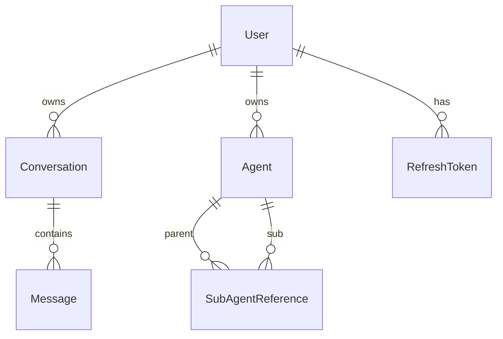
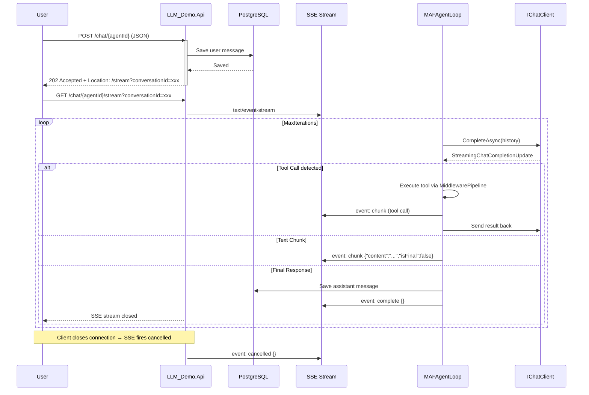

# 🧠 LLM_Demo — Multi-Agent Framework на .NET 8

**LLM_Demo** — это демонстрационный проект Multi-Agent Framework (MAF) на C# 12 / .NET 8, построенный поверх `IChatClient` (Microsoft.Extensions.AI) с интеграцией **Orleans** для распределённых агентов и **Quartz.NET** для шедулинга.

---

## 🚀 Быстрый старт

### 1. Запустить PostgreSQL через Docker

```bash
docker compose -f docker/docker-compose.yml up -d
```

### 2. Запустить API

```bash
dotnet run --project src/LLM_Demo.Api
```

Swagger UI будет доступен по адресу: `http://localhost:5023/swagger`

### 3. Получить JWT токен

```bash
curl -X POST http://localhost:5023/api/auth/login \
  -H "Content-Type: application/json" \
  -d '{"email":"demo@example.com","password":"Demo123!"}'
```

### 4. Использовать API

```bash
curl http://localhost:5023/api/agents \
  -H "Authorization: Bearer <token>"
```

---

## 🏗️ Архитектура

```
┌─────────────────────────────────────────────────────────────┐
│          LLM_Demo.Frontend (React + Vite + Tailwind CSS)    │
│  SPA · SSE Client · JWT Auth · Axios · React Router         │
└─────────────────────────┬───────────────────────────────────┘
                          │
┌─────────────────────────▼───────────────────────────────────┐
│                    LLM_Demo.Api (Minimal API)                │
│  JWT Auth · SSE Streaming · Swagger · Ownership Middleware   │
└─────────────────────┬───────────────────────────────────────┘
                      │
┌─────────────────────▼───────────────────────────────────────┐
│                LLM_Demo.Application (Use Cases)              │
│  MAFAgentLoop · ToolMiddlewarePipeline · SubAgentOrchestrator│
└─────────────────────┬───────────────────────────────────────┘
                      │
┌─────────────────────▼───────────────────────────────────────┐
│               LLM_Demo.Infrastructure (Services)             │
│  EF Core + PostgreSQL · JWT · Quartz.NET · ConnectorProvider│
│  Tools: SendSafety · Calculator · FileSystem │
└─────────────────────┬───────────────────────────────────────┘
                      │
┌─────────────────────▼───────────────────────────────────────┐
│              LLM_Demo.Agents (Orleans Grains)               │
│  AgentGrain · ConversationGrain · SubAgentGrain             │
└─────────────────────┬───────────────────────────────────────┘
                      │
┌─────────────────────▼───────────────────────────────────────┐
│                 LLM_Demo.Domain (Core)                       │
│  Agent · Message · Conversation · Tool · Middleware Interfaces│
└─────────────────────────────────────────────────────────────┘
```

---

## 🧩 Ключевые компоненты

### Agent Loop (MAF поверх IChatClient)

```csharp
// Итеративный цикл: LLM → ToolCall → MiddlewarePipeline → LLM
var loop = new MAFAgentLoop(chatClient, toolExecutor, logger);
var result = await loop.ExecuteAsync(conversation, agent);
```

### Tool Middleware Pipeline

Цепочка middleware в порядке выполнения:

1. **LoggingMiddleware** — логирование всех вызовов инструментов
2. **FilteringMiddleware** — проверка разрешённых инструментов для агента
3. **SafetyMiddleware** — фильтрация опасных паттернов (send-safety)
4. **StreamingMiddleware** — трансляция чанков подписчикам SSE

### SSE Streaming

Потоковая передача ответа LLM через Server-Sent Events. Клиент сначала отправляет сообщение через `POST`, получает `202 Accepted` с URL на SSE-поток, затем подключается к этому потоку.

```
POST /api/chat/{agentId} (JSON) → 202 Accepted + Location: /api/chat/{agentId}/stream?conversationId=xxx
GET /api/chat/{agentId}/stream?conversationId=xxx&token=<JWT>
→ event: chunk  data: {"content":"Hello","isFinal":false}
→ event: chunk  data: {"content":" world","isFinal":false}
→ event: complete  data: {}
```

Токен авторизации передаётся в query-параметре `token`, т.к. `EventSource` API не поддерживает кастомные HTTP-заголовки (`Authorization: Bearer ...`).

Дополнительные SSE-события:

| Событие | Описание |
|---------|----------|
| `chunk` | Очередной чанк стриминга (текст или tool call) |
| `complete` | Стриминг завершён, ответ ассистента сохранён |
| `cancelled` | Клиент разорвал соединение |
| `error` | Ошибка сервера (текст ошибки в `data`) |

### Connectors

Все LLM-провайдеры (OpenAI, Ollama, Azure и др.) регистрируются через [`OpenAIConnectorFactory`](src/LLM_Demo.Infrastructure/Connectors/OpenAIConnector.cs), который создаёт `IChatClient` поверх `HttpClient`. Каждый провайдер конфигурируется в секции `LLMProviders` в [`appsettings.json`](src/LLM_Demo.Api/appsettings.json):

```json
{
  "LLMProviders": {
    "openai": { "Endpoint": "https://api.openai.com/v1", "ModelId": "gpt-4", "ApiKey": "..." },
    "ollama": { "Endpoint": "http://localhost:11434/v1", "ModelId": "llama3" },
    "azure":  { "Endpoint": "https://xxx.openai.azure.com", "ModelId": "gpt-4", "ApiKey": "..." }
  }
}
```

Единый интерфейс для всех провайдеров:

```csharp
// IConnectorProvider — получение IChatClient по имени провайдера
provider.GetClient("openai");
provider.GetClient("ollama");
provider.GetClient("azure");
```

Если ни один LLM-провайдер не настроен, автоматически подключается [`EchoChatClient`](src/LLM_Demo.Api/Endpoints/ChatEndpoints.cs) — fallback, который возвращает введённый пользователем текст с префиксом `"Echo: "`.

---

## 📋 API Endpoints

### Аутентификация

| Method | Path | Описание |
|--------|------|----------|
| POST | `/api/auth/register` | Регистрация |
| POST | `/api/auth/login` | Вход, получение JWT |

### Агенты

| Method | Path | Описание |
|--------|------|----------|
| GET | `/api/agents` | Список агентов |
| POST | `/api/agents` | Создать агента |
| GET | `/api/agents/{id}` | Получить агента |
| PUT | `/api/agents/{id}` | Обновить агента |
| DELETE | `/api/agents/{id}` | Удалить агента |

### Беседы

| Method | Path | Описание |
|--------|------|----------|
| GET | `/api/conversations` | Список бесед |
| POST | `/api/conversations` | Создать беседу |
| GET | `/api/conversations/{id}` | Получить беседу |
| GET | `/api/conversations/{id}/messages` | Сообщения беседы |

### Чат

| Method | Path | Описание |
|--------|------|----------|
| POST | `/api/chat/{agentId}` | Отправить сообщение (JSON) |
| GET | `/api/chat/{agentId}/stream` | Отправить сообщение (SSE stream) |

### Инструменты

| Method | Path | Описание |
|--------|------|----------|
| GET | `/api/tools` | Список доступных инструментов |

### Connectors (LLM-провайдеры)

| Method | Path | Описание |
|--------|------|----------|
| GET | `/api/connectors` | Список доступных LLM-провайдеров |

---

## 🛠️ Технический стек

| Компонент | Технология |
|-----------|-----------|
| **Язык** | C# 12 (.NET 8) |
| **AI/LLM** | `IChatClient` (Microsoft.Extensions.AI) |
| **Оркестрация** | Orleans 8.x (Grains) |
| **ORM** | Entity Framework Core 8 + Npgsql |
| **База данных** | PostgreSQL 16 |
| **Шедулинг** | Quartz.NET 3.x |
| **Аутентификация** | JWT Bearer (ASP.NET Core) |
| **Стриминг** | Server-Sent Events (SSE) |
| **Тестирование** | xUnit + Moq + FluentAssertions |
| **Контейнеризация** | Docker / Docker Compose |

---

## 🐳 Docker Compose

```yaml
services:
  postgres:
    image: postgres:16
    environment:
      POSTGRES_DB: llm_demo
      POSTGRES_USER: llm_demo_user
      POSTGRES_PASSWORD: llm_demo_pass
    ports:
      - "5434:5432"

  postgres-orleans:
    image: postgres:16
    environment:
      POSTGRES_DB: orleans
      POSTGRES_USER: orleans_user
      POSTGRES_PASSWORD: orleans_pass
    ports:
      - "5435:5432"
```

---

## 📦 Миграции БД (EF Core)

В проекте используется **Entity Framework Core** с **PostgreSQL**. Миграции создаются в проекте [`LLM_Demo.Infrastructure`](src/LLM_Demo.Infrastructure), а применяются автоматически при запуске API через `DbSeeder.SeedAsync()`.

### Установка инструмента

В проекте используется локальный манифест `.config/dotnet-tools.json`, поэтому предпочтительный способ:

```bash
dotnet tool restore
```

Либо глобальная установка:

```bash
dotnet tool install --global dotnet-ef
```

### Создать новую миграцию (после изменения моделей)

```bash
dotnet ef migrations add <НазваниеМиграции> --project src/LLM_Demo.Infrastructure --startup-project src/LLM_Demo.Api
```

**Пример:**
```bash
dotnet ef migrations add AddCategoryEntity --project src/LLM_Demo.Infrastructure --startup-project src/LLM_Demo.Api
```

### Применить миграцию к БД

```bash
dotnet ef database update --project src/LLM_Demo.Infrastructure --startup-project src/LLM_Demo.Api
```

Либо просто запустить API — миграции применятся автоматически.

### Откатить последнюю миграцию

```bash
dotnet ef migrations remove --project src/LLM_Demo.Infrastructure --startup-project src/LLM_Demo.Api
```

### Полезные команды

| Команда | Описание |
|---------|----------|
| `dotnet ef migrations list ...` | Список всех миграций |
| `dotnet ef migrations script ...` | SQL-скрипт миграции |
| `dotnet ef database update <Миграция> ...` | Откат/переход к конкретной миграции |

> **Примечание:** Все команды должны выполняться из корня проекта (`d:/work/LLM_Demo`) с параметрами `--project src/LLM_Demo.Infrastructure --startup-project src/LLM_Demo.Api`.

### Схема БД



### Seed-данные

При первом запуске API автоматически загружаются тестовые данные:

- **Пользователь:** `demo@example.com` / `Demo123!`
- **Агенты:** General Assistant, Copywriting Assistant, Code Reviewer
- **Диалог:** тестовый диалог с 3 сообщениями

---

## 🧪 Тестирование

```bash
# Запуск всех тестов
dotnet test

# Результат: 27 passed, 0 failed
```

Тесты покрывают:
- ✅ Domain Models (Agent, Message, Conversation, ToolResult)
- ✅ Middleware (Filtering, Safety, Logging)
- ✅ SubAgent Orchestrator
- ✅ Tool Registry
- ✅ Ownership Service
- ✅ SendSafety Tool
- ✅ Calculator Tool

---

## 📁 Структура проекта

```
LLM_Demo/
├── src/
│   ├── LLM_Demo.Domain/           # Модели и интерфейсы
│   │   ├── Agents/                # Agent, AgentStatus, IAgentLoop
│   │   ├── Messages/              # Message, MessageRole, StreamingChunk
│   │   ├── Conversations/         # Conversation, ConversationStatus
│   │   ├── Tools/                 # ToolDefinition, ToolResult, ToolCall
│   │   ├── Middleware/            # IToolMiddleware, ToolMiddlewareContext
│   │   ├── Connectors/            # IConnectorProvider
│   │   ├── Common/                # Result<T>, IRepository<T>
│   │   └── Ownership/             # IOwnable
│   │
│   ├── LLM_Demo.Application/      # Use Cases
│   │   ├── AgentLoop/             # MAFAgentLoop
│   │   ├── Middleware/            # Pipeline, Logging, Filtering, Safety, Streaming
│   │   ├── SubAgents/             # Orchestrator, Router
│   │   └── Ownership/             # OwnershipService
│   │
│   ├── LLM_Demo.Infrastructure/   # Реализации
│   │   ├── Persistence/           # EF Core DbContext, Repositories
│   │   ├── Auth/                  # JwtTokenService, JwtOptions
│   │   ├── Connectors/            # ConnectorProvider, OpenAIConnector
│   │   ├── Tools/                 # SendSafety, Calculator, FileSystem, ToolRegistry
│   │   └── Scheduling/            # QuartzService, AgentJob, ToolJob
│   │
│   ├── LLM_Demo.Agents/           # Orleans Grains
│   │   ├── Interfaces/            # IAgentGrain, IConversationGrain, ISubAgentGrain
│   │   ├── Grains/                # AgentGrain, ConversationGrain, SubAgentGrain
│   │   └── Configuration/         # OrleansConfigurator
│   │
│   ├── LLM_Demo.Frontend/         # React SPA (Vite + Tailwind CSS)
│   │   ├── src/
│   │   │   ├── api/               # Axios client, chat SSE, auth
│   │   │   ├── components/        # ChatMessages, MessageBubble, ChatInput, etc.
│   │   │   ├── hooks/             # useChatSSE
│   │   │   ├── context/           # AuthContext
│   │   │   ├── pages/             # ChatPage, LoginPage, RegisterPage
│   │   │   └── types/             # TypeScript types
│   │   └── vite.config.ts
│   │
│   └── LLM_Demo.Api/              # Minimal API
│       ├── Endpoints/             # Auth, Agent, Conversation, Chat
│       ├── Middleware/            # ExceptionHandlingMiddleware
│       ├── Models/                # Request/Response DTOs
│       └── Extensions/            # EndpointExtensions
│
├── tests/
│   └── LLM_Demo.Tests/            # 27 unit-тестов
│
├── docker/
│   └── docker-compose.yml         # PostgreSQL + Orleans DB
├── plans/
│   └── project-plan.md            # Детальный план с диаграммами
└── README.md                      # Этот файл
```

---

## 🔄 Agent Loop Flow



---

## 📜 Вспомогательные скрипты

| Скрипт | Назначение |
|--------|------------|
| [`run.cmd`](run.cmd) | Полный stack: устанавливает npm-зависимости фронтенда, запускает API (`dotnet run`) и Frontend (`npm run dev`) в отдельных окнах терминалов |
| [`run_api.cmd`](run_api.cmd) | Запуск только API: `dotnet run --project src/LLM_Demo.Api` |
| [`run_front.cmd`](run_front.cmd) | Запуск только Frontend: `npm run dev` в директории `src/LLM_Demo.Frontend` |
| [`run_migration.cmd`](run_migration.cmd) | Применение миграций EF Core к БД (восстанавливает `dotnet-ef` из локального манифеста и выполняет `dotnet ef database update`) |

Перед первым запуском убедитесь, что PostgreSQL запущен (см. шаг 1 Быстрого старта). Для полного запуска достаточно выполнить:

```cmd
run.cmd
```

---

## 📄 Лицензия

MIT
