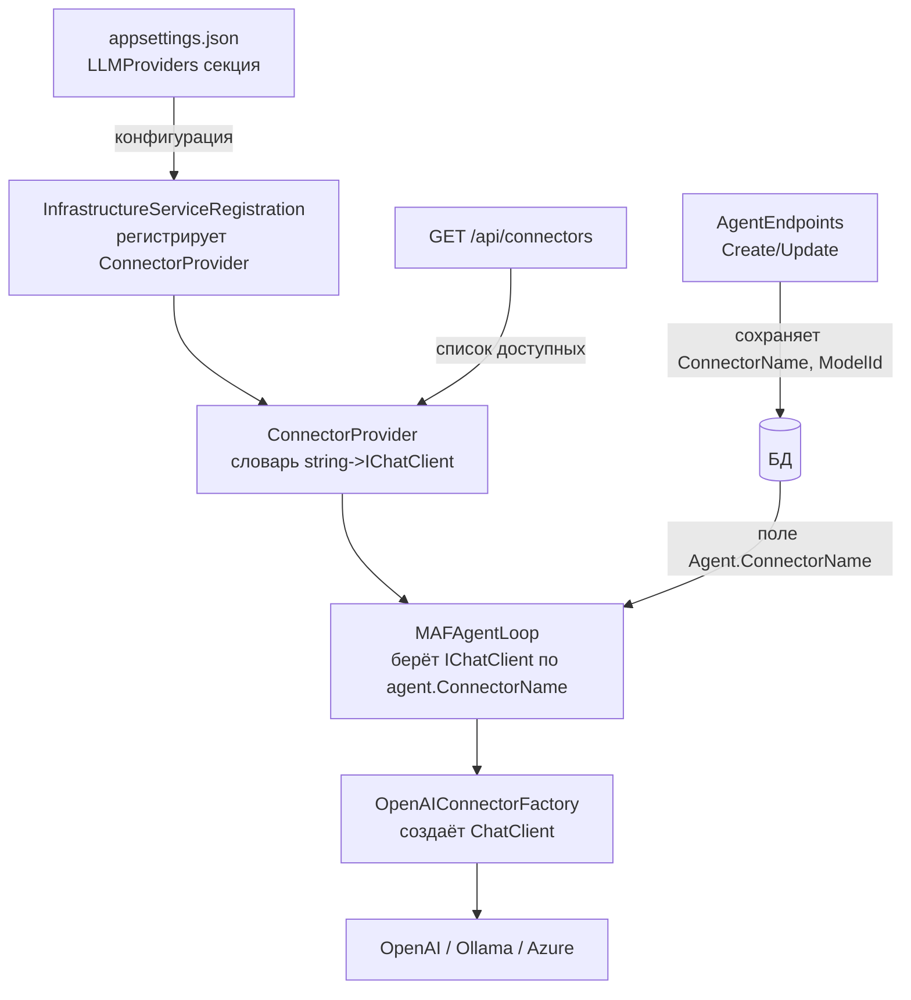

# План: Выбор LLM-провайдера для каждого агента

## Текущая ситуация

- В [`Program.cs:95`](../src/LLM_Demo.Api/Program.cs:95) регистрируется **один** `IChatClient` на всё приложение (`EchoChatClient`)
- [`MAFAgentLoop`](../src/LLM_Demo.Application/AgentLoop/MAFAgentLoop.cs:23-33) получает один `IChatClient` через конструктор — все агенты используют один и тот же
- В [`Agent.cs`](../src/LLM_Demo.Domain/Agents/Agent.cs) **нет** полей для указания провайдера или модели
- **Уже есть задел:** [`IConnectorProvider`](../src/LLM_Demo.Domain/Connectors/IConnectorProvider.cs) и [`OpenAIConnectorFactory`](../src/LLM_Demo.Infrastructure/Connectors/OpenAIConnector.cs:9-23) — есть инфраструктура для множественных провайдеров

## Что нужно изменить

### 1. Domain — добавить поля в Agent

В [`Agent.cs`](../src/LLM_Demo.Domain/Agents/Agent.cs) добавить:

```csharp
public string ConnectorName { get; set; } = "default";
public string ModelId { get; set; } = string.Empty;
```

- `ConnectorName` — имя провайдера (например `"openai"`, `"ollama"`, `"azure"`)
- `ModelId` — идентификатор модели (например `"gpt-4"`, `"llama3.1"`)

### 2. Infrastructure — регистрация ConnectorProvider в DI

В [`InfrastructureServiceRegistration.cs`](../src/LLM_Demo.Infrastructure/DI/InfrastructureServiceRegistration.cs) добавить:

- Регистрация `IConnectorProvider` как singleton
- Чтение секции `LLMProviders` из конфигурации
- Для каждого провайдера создать `IChatClient` через `OpenAIConnectorFactory` + `HttpClient`
- Зарегистрировать именованные `HttpClient` для каждого провайдера

### 3. Infrastructure — AppDbContext migration

Добавить миграцию на новые поля `ConnectorName` и `ModelId` в таблице `Agents`.

### 4. Application — MAFAgentLoop использует IConnectorProvider

Изменить [`MAFAgentLoop`](../src/LLM_Demo.Application/AgentLoop/MAFAgentLoop.cs):

- Вместо `IChatClient` принимать `IConnectorProvider`
- В `ExecuteAsync` получать `IChatClient` на основе `agent.ConnectorName`:

```csharp
var chatClient = _connectorProvider.GetClient(agent.ConnectorName);
```

- Передавать `agent.ModelId` в `ChatOptions` при вызове `CompleteAsync`

### 5. API — обновить request/response модели

В [`AgentRequests.cs`](../src/LLM_Demo.Api/Models/Requests/AgentRequests.cs):

```csharp
public sealed record CreateAgentRequest(
    string Name,
    string SystemPrompt,
    string? ConnectorName,
    string? ModelId);

public sealed record UpdateAgentRequest(
    string? Name,
    string? SystemPrompt,
    string? ConnectorName,
    string? ModelId);
```

### 6. API — обновить ChatEndpoints

В [`ChatEndpoints.cs`](../src/LLM_Demo.Api/Endpoints/ChatEndpoints.cs):

- Заменить `IChatClient` на `IConnectorProvider`
- Удалить EchoChatClient из DI
- Передать `IConnectorProvider` в `MAFAgentLoop`

### 7. API — обновить AgentEndpoints

В [`AgentEndpoints.cs`](../src/LLM_Demo.Api/Endpoints/AgentEndpoints.cs):

- В `Create` и `Update` передавать `ConnectorName` и `ModelId`

### 8. API — конфигурация провайдеров

В [`appsettings.json`](../src/LLM_Demo.Api/appsettings.json) добавить:

```json
"LLMProviders": {
  "default": {
    "Endpoint": "http://localhost:11434",
    "ModelId": "llama3.1",
    "ApiKey": ""
  },
  "openai": {
    "Endpoint": "https://api.openai.com/v1",
    "ModelId": "gpt-4o-mini",
    "ApiKey": "sk-..."
  }
}
```

### 9. API — обновить DbSeeder

В [`DbSeeder.cs`](../src/LLM_Demo.Infrastructure/Persistence/DbSeeder.cs):

- Для разных демо-агентов задать разные `ConnectorName` и `ModelId`
- Например: General Assistant → `default/llama3.1`, Copywriting → `openai/gpt-4o-mini`

### 10. API — добавить endpoint для списка провайдеров

В [`AgentEndpoints`](../src/LLM_Demo.Api/Endpoints/AgentEndpoints.cs) или отдельном эндпоинте:

- `GET /api/connectors` — возвращает список доступных провайдеров (из `IConnectorProvider.GetAvailableConnectors()`)

---

## Схема изменений



## Порядок реализации

1. Domain: поля `ConnectorName` + `ModelId` в `Agent.cs`
2. API: добавить секцию `LLMProviders` в `appsettings.json`
3. Infrastructure: регистрация `IConnectorProvider` в DI
4. Application: `MAFAgentLoop` через `IConnectorProvider`
5. API: обновить `AgentRequests` (Create/Update)
6. API: обновить `AgentEndpoints` (передавать новые поля)
7. API: обновить `ChatEndpoints` (использовать `IConnectorProvider`)
8. API: убрать `EchoChatClient` из DI
9. Infrastructure: добавить миграцию БД
10. Infrastructure: обновить `DbSeeder`
11. API: добавить `GET /api/connectors`
