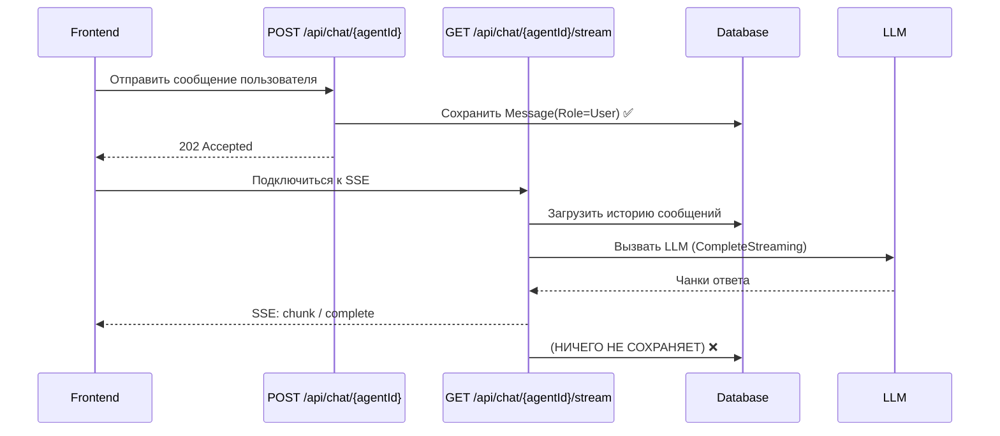
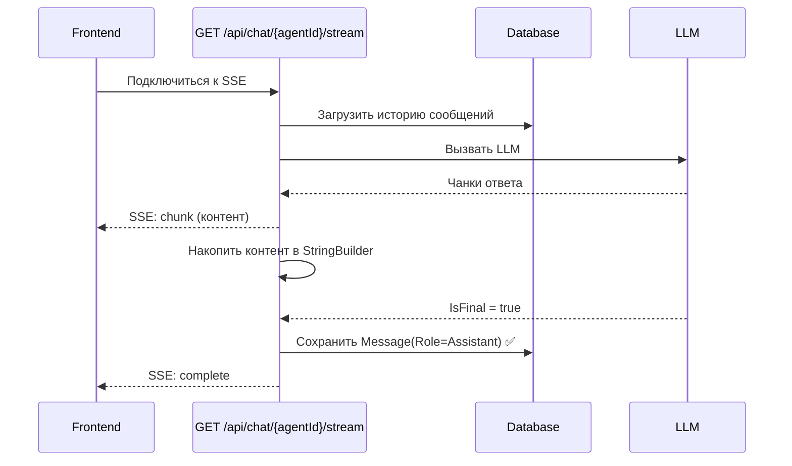

# План: Ответы AI не сохраняются в базу данных

## Проблема

При отправке сообщения в чате:

1. **REST-эндпоинт** [`Chat()`](src/LLM_Demo.Api/Endpoints/ChatEndpoints.cs:37) сохраняет сообщение пользователя в БД ✅
2. **SSE-эндпоинт** [`ChatStream()`](src/LLM_Demo.Api/Endpoints/ChatEndpoints.cs:64) загружает историю, стримит ответ AI через SSE, но **НЕ СОХРАНЯЕТ ответ ассистента в БД** ❌

**Результат:** После перезагрузки страницы или переключения беседы ответ AI пропадает — в БД есть только сообщение пользователя, но не ответ ассистента.

## Поток данных (текущий)



## Решение

Добавить сохранение ответа ассистента в методе [`ChatStream()`](src/LLM_Demo.Api/Endpoints/ChatEndpoints.cs:64) после завершения стриминга.

### Изменения в `ChatStream()`

Накопить весь текст ответа AI в `StringBuilder` в процессе стриминга, и после получения `IsFinal = true` (или после выхода из цикла) сохранить сообщение в БД:



### Конкретные изменения

**Файл:** `src/LLM_Demo.Api/Endpoints/ChatEndpoints.cs`

В методе `ChatStream()` (начиная со строки 116):

1. Добавить `var responseBuilder = new System.Text.StringBuilder();` перед циклом `foreach`.
2. Внутри цикла, после получения чанка, добавлять `responseBuilder.Append(chunk.Content);`.
3. После цикла `foreach` (или при `IsFinal = true`) создать и сохранить `Message` с ролью `MessageRole.Assistant`.

**Важно:** Обработка ошибок — если стриминг был отменён или произошла ошибка, **НЕ** сохранять пустой или неполный ответ. Сохранять только при успешном получении `IsFinal = true`.

### Код изменений

```csharp
// В ChatStream(), после вызова loop.ExecuteStreamingAsync()

var responseBuilder = new System.Text.StringBuilder();

try
{
    var ct = httpContext.RequestAborted;
    await foreach (var chunk in loop.ExecuteStreamingAsync(conversation, agent, historyMessages, ct: ct))
    {
        var json = JsonSerializer.Serialize(chunk, new JsonSerializerOptions
        {
            PropertyNamingPolicy = JsonNamingPolicy.CamelCase
        });
        await WriteSseAsync(httpContext, "chunk", json);

        if (!chunk.IsFinal)
        {
            responseBuilder.Append(chunk.Content);
        }

        if (chunk.IsFinal)
        {
            // Сохраняем ответ ассистента в БД
            var assistantMessage = new Message
            {
                Id = Guid.NewGuid(),
                ConversationId = conversation.Id,
                Role = MessageRole.Assistant,
                Content = responseBuilder.ToString()
            };
            await _conversationRepository.AddMessageAsync(assistantMessage, ct);
            
            await WriteSseAsync(httpContext, "complete", "{}");
        }
    }
}
```

### Проверка

После исправления:
1. Отправить сообщение в чат
2. Дождаться ответа AI
3. Перезагрузить страницу — сообщения должны сохраниться
4. Переключиться на другую беседу и обратно — история должна загружаться с ответами AI
