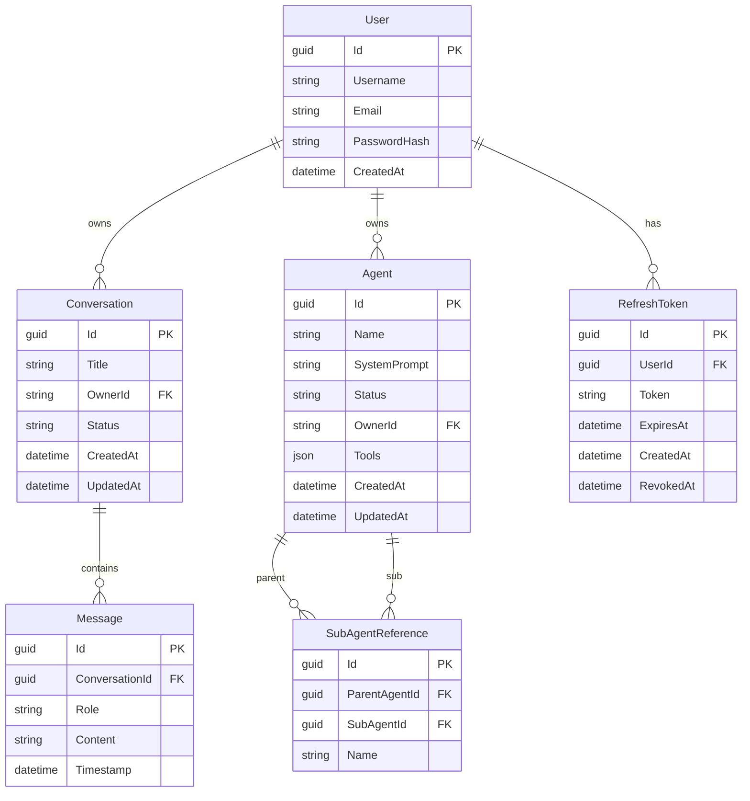
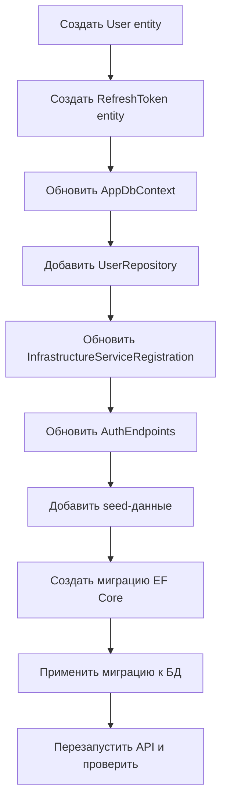

# План: Полная схема БД + миграции + seed-данные

## Текущее состояние

| Компонент | Статус |
|-----------|--------|
| PostgreSQL 16 в Docker (llm_demo:5434) | ✅ Развёрнут |
| `Agent` entity | ✅ Существует |
| `Conversation` entity | ✅ Существует |
| `Message` entity | ✅ Существует |
| `SubAgentReference` entity | ✅ Существует в Domain, ❌ НЕ добавлен в DbContext |
| `User` entity | ❌ Отсутствует |
| `RefreshToken` entity | ❌ Отсутствует |
| `Agent.Tools` (List\<ToolDefinition\>) | ❌ Не настроен JSON mapping |
| EF Core Migrations | ❌ Не созданы |
| Аутентификация (JWT) | ⚠️ Используется, но без сохранения пользователей |
| Seed-данные | ❌ Отсутствуют |

---

## План работ

### Шаг 1: Создать entity `User` в Domain

**Файл:** `src/LLM_Demo.Domain/Users/User.cs`

```csharp
namespace LLM_Demo.Domain.Users;

public sealed class User
{
    public Guid Id { get; set; }
    public string Username { get; set; } = string.Empty;
    public string Email { get; set; } = string.Empty;
    public string PasswordHash { get; set; } = string.Empty;
    public DateTime CreatedAt { get; set; } = DateTime.UtcNow;
}
```

### Шаг 2: Создать entity `RefreshToken` в Domain

**Файл:** `src/LLM_Demo.Domain/Users/RefreshToken.cs`

```csharp
namespace LLM_Demo.Domain.Users;

public sealed class RefreshToken
{
    public Guid Id { get; set; }
    public Guid UserId { get; set; }
    public string Token { get; set; } = string.Empty;
    public DateTime ExpiresAt { get; set; }
    public DateTime CreatedAt { get; set; } = DateTime.UtcNow;
    public DateTime? RevokedAt { get; set; }
    public bool IsExpired => DateTime.UtcNow >= ExpiresAt;
    public bool IsRevoked => RevokedAt is not null;
    public bool IsActive => !IsExpired && !IsRevoked;
}
```

### Шаг 3: Обновить `AppDbContext`

**Файл:** `src/LLM_Demo.Infrastructure/Persistence/AppDbContext.cs`

- Добавить `DbSet<User> Users`
- Добавить `DbSet<RefreshToken> RefreshTokens`
- Добавить fluent-конфигурацию для `User` и `RefreshToken`
- Для `SubAgentReference` — добавить отдельную таблицу `SubAgentReferences` со связью FK на `Agents`
- Для `Agent.Tools` (List\<ToolDefinition\>) — настроить JSON-сериализацию через `HasConversion` или `OwnsMany` (проще — JSON столбец)

### Шаг 4: Обновить репозитории

**Файл:** `src/LLM_Demo.Infrastructure/Persistence/Repositories/UserRepository.cs` (НОВЫЙ)

Методы:
- `GetByIdAsync(Guid id)`
- `GetByEmailAsync(string email)`
- `AddAsync(User user)`

### Шаг 5: Обновить `InfrastructureServiceRegistration`

- Зарегистрировать `UserRepository` как scoped сервис

### Шаг 6: Обновить `AuthEndpoints`

**Файл:** `src/LLM_Demo.Api/Endpoints/AuthEndpoints.cs`

- `Register`: создавать реального пользователя в БД (хэшировать пароль через BCrypt)
- `Login`: проверять email + password hash в БД
- Возвращать реальный `userId` из БД вместо `Guid.NewGuid()`

### Шаг 7: Создать Seed-данные

Через `AppDbContext` seed или отдельный сеed-класс/миграцию:

1. **Тестовый пользователь:**
   - Username: `demo_user`
   - Email: `demo@example.com`
   - Password: `Demo123!` (BCrypt hash)

2. **Тестовые агенты (2-3 шт.):**
   - Copywriting Assistant (agent) — системный промпт про копирайтинг
   - Code Reviewer (агент) — системный промпт про ревью кода
   - General Assistant (агент по умолчанию)

3. **Тестовый диалог:**
   - Conversation "Тестовый диалог" для демо-пользователя
   - 2-3 сообщения (User -> Assistant)

### Шаг 8: Создать и применить миграцию

```bash
dotnet ef migrations add InitialCreate --project src/LLM_Demo.Infrastructure --startup-project src/LLM_Demo.Api
dotnet ef database update --project src/LLM_Demo.Infrastructure --startup-project src/LLM_Demo.Api
```

Либо создать SQL-скрипт миграции для ручного применения.

---

## ER-диаграмма (Mermaid)



---

## Порядок выполнения задач



---

## Файлы, которые будут изменены/созданы

### Новые файлы:
- `src/LLM_Demo.Domain/Users/User.cs`
- `src/LLM_Demo.Domain/Users/RefreshToken.cs`
- `src/LLM_Demo.Infrastructure/Persistence/Repositories/UserRepository.cs`

### Изменённые файлы:
- `src/LLM_Demo.Infrastructure/Persistence/AppDbContext.cs` — новые DbSet + конфигурация
- `src/LLM_Demo.Infrastructure/DI/InfrastructureServiceRegistration.cs` — регистрация UserRepository
- `src/LLM_Demo.Api/Endpoints/AuthEndpoints.cs` — реальная работа с пользователями
- `src/LLM_Demo.Domain/LLM_Demo.Domain.csproj` — обычно не меняется, т.к. новые .cs файлы в той же папке
