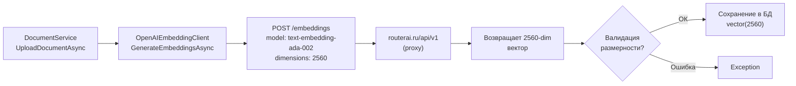

# План исправления ошибки размерности эмбеддингов

## Коренная причина

Ошибка `expected 1536 dimensions, not 2560` возникает из-за несоответствия между:

1. **БД:** колонка `Embedding` в таблице `DocumentChunks` определена как `vector(1536)` (см. миграцию [`20260720144343_AddDocumentsTables.cs`](src/LLM_Demo.Infrastructure/Migrations/20260720144343_AddDocumentsTables.cs:42))
2. **API эмбеддингов:** эндпоинт `https://routerai.ru/api/v1/embeddings` возвращает векторы размерностью **2560**, а не 1536

Несмотря на то, что в конфигурации [`appsettings.json`](src/LLM_Demo.Api/appsettings.json:21-26) указан `Dimensions = 1536` и модель `text-embedding-ada-002` (которая должна давать 1536), прокси-эндпоинт `routerai.ru`, вероятно, маппит модель на другую (возможно `text-embedding-3-large`), возвращающую 2560 измерений.

## Шаги по исправлению

### Шаг 1: Обновить конфигурацию `appsettings.json`

Изменить `"Dimensions": 1536` → `"Dimensions": 2560` в секции `Embedding`.

### Шаг 2: Добавить параметр `dimensions` в запрос к API эмбеддингов

В [`OpenAIEmbeddingClient.cs`](src/LLM_Demo.Infrastructure/RAG/OpenAIEmbeddingClient.cs:44-48) добавить поле `dimensions` в тело запроса:

```csharp
var requestBody = new
{
    model = _modelId,
    input = textsList.Count == 1 ? textsList[0] : (object)textsList,
    dimensions = Dimensions
};
```

Это позволит явно запрашивать нужную размерность у API, если он поддерживает этот параметр (поддерживается моделями `text-embedding-3-*`).

### Шаг 3: Создать новую миграцию БД

Изменить тип колонки `Embedding` с `vector(1536)` на `vector(2560)`.

```csharp
migrationBuilder.AlterColumn<Vector>(
    name: "Embedding",
    schema: "llm_demo",
    table: "DocumentChunks",
    type: "vector(2560)",
    nullable: true);
```

Команда для создания миграции:
```
dotnet ef migrations add FixEmbeddingDimensions --project src/LLM_Demo.Infrastructure --startup-project src/LLM_Demo.Api
```

### Шаг 4: Применить миграцию

```
dotnet ef database update --project src/LLM_Demo.Infrastructure --startup-project src/LLM_Demo.Api
```

Либо через скрипт:
```
run_migration.cmd
```

### Шаг 5 (опционально): Добавить валидацию размерности

В [`OpenAIEmbeddingClient.cs`](src/LLM_Demo.Infrastructure/RAG/OpenAIEmbeddingClient.cs:78-82), после десериализации ответа, добавить проверку:

```csharp
foreach (var data in result.data)
{
    if (data.embedding.Length != Dimensions)
    {
        throw new InvalidOperationException(
            $"Embedding API returned vector with {data.embedding.Length} dimensions, " +
            $"but {Dimensions} were expected. Check the model '{_modelId}' configuration.");
    }
}
```

## Схема потока данных (до и после)



## Проверка после исправления

1. Запустить API: `run_api.cmd`
2. Отправить запрос на загрузку документа через `LLM_Demo.Api.http` (POST `/agents/{agentId}/documents`)
3. Убедиться, что ошибка `expected 1536 dimensions, not 2560` больше не появляется
4. Проверить, что документ и чанки успешно сохранились в БД
