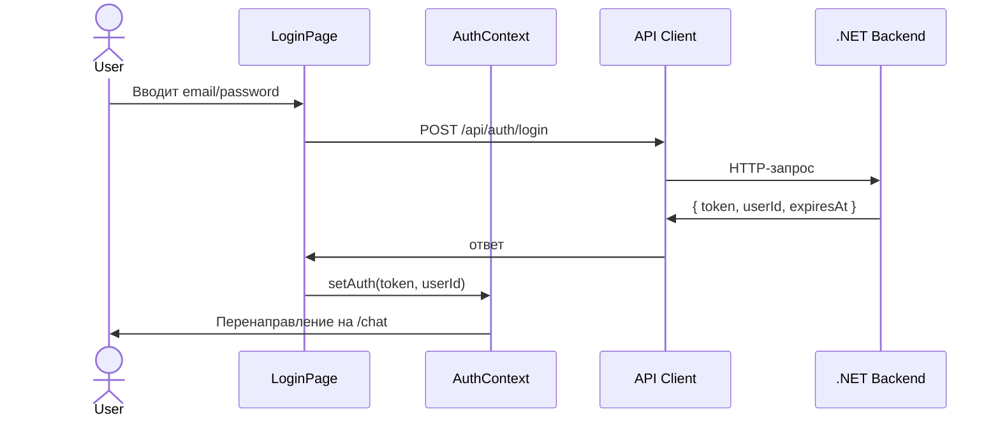
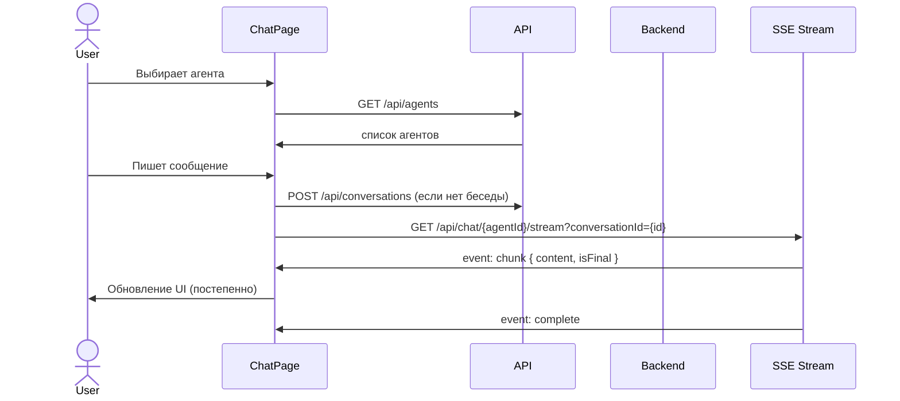
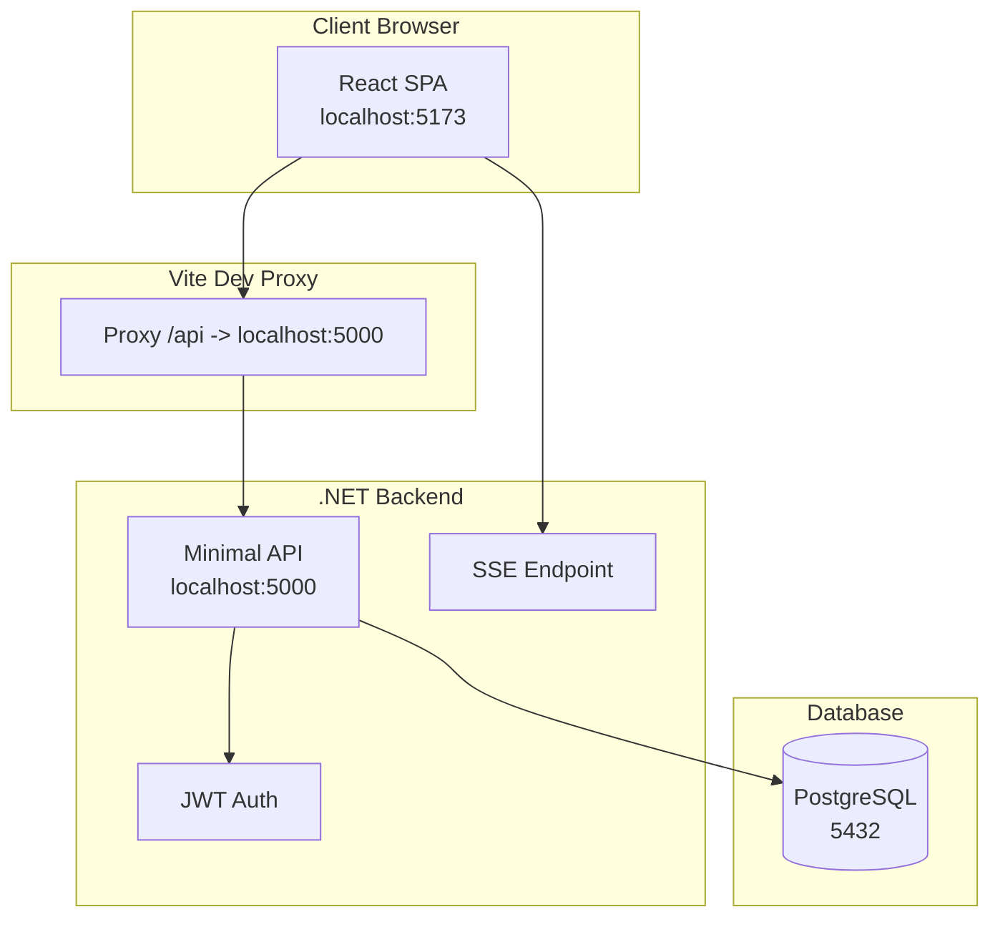

# 🎨 План добавления React-фронтенда (LLM_Demo.Frontend)

## 📋 Обзор

Добавление React-приложения `src/LLM_Demo.Frontend/` для чат-интерфейса с агентами.
Фронтенд общается с существующим Minimal API бэкендом.

---

## 🗂️ 1. Структура папок

```
src/
├── LLM_Demo.Api/                     # Существующий бэкенд (без изменений)
└── LLM_Demo.Frontend/                # ✅ НОВЫЙ React-фронтенд
    ├── index.html
    ├── package.json
    ├── tsconfig.json
    ├── tsconfig.node.json
    ├── vite.config.ts
    ├── public/
    └── src/
        ├── main.tsx                  # Точка входа
        ├── App.tsx                   # Роутинг
        ├── index.css                 # Глобальные стили
        ├── types/                    # TypeScript-типы
        │   ├── auth.ts
        │   ├── agent.ts
        │   ├── conversation.ts
        │   └── chat.ts
        ├── api/                      # API-клиент
        │   ├── client.ts             # Axios/HTTP-клиент с JWT
        │   ├── auth.ts              # POST /api/auth/login, /register
        │   ├── agents.ts            # GET /api/agents
        │   └── chat.ts              # GET /api/chat/{agentId}/stream (SSE)
        ├── context/                  # React-контексты
        │   └── AuthContext.tsx       # JWT-токен, user, login/logout
        ├── hooks/                    # Кастомные хуки
        │   └── useChatSSE.ts        # SSE-подключение к стримингу
        ├── pages/
        │   ├── LoginPage.tsx
        │   ├── RegisterPage.tsx
        │   ├── ChatPage.tsx
        │   └── NotFoundPage.tsx
        └── components/
            ├── Layout.tsx            # Шапка + main + переходы
            ├── ProtectedRoute.tsx    # Guard для авторизации
            ├── AgentSelector.tsx     # Выпадающий список агентов
            ├── ConversationList.tsx  # Список бесед
            ├── ChatMessages.tsx      # Контейнер сообщений
            ├── ChatInput.tsx         # Поле ввода + отправка
            └── MessageBubble.tsx     # Отдельное сообщение
```

---

## 🧩 2. Компоненты и их ответственность

### 2.1. Страницы (Pages)

| Страница | Путь | Описание |
|----------|------|----------|
| `LoginPage` | `/login` | Форма входа (email + password). POST /api/auth/login |
| `RegisterPage` | `/register` | Форма регистрации. POST /api/auth/register |
| `ChatPage` | `/chat` | Главная страница: выбор агента, беседа, чат |
| `NotFoundPage` | `*` | 404 |

### 2.2. Компоненты (Components)

| Компонент | Назначение |
|-----------|------------|
| `Layout` | Шапка с логотипом, кнопкой Logout, `<Outlet />` |
| `ProtectedRoute` | Перенаправляет на `/login` если нет токена |
| `AgentSelector` | Выпадающий список агентов (GET /api/agents) |
| `ConversationList` | Список бесед, кнопка "Новая беседа" |
| `ChatMessages` | Прокручиваемый контейнер сообщений |
| `ChatInput` | Текстовое поле + кнопка Send |
| `MessageBubble` | Сообщение (user/assistant), markdown-рендеринг |

---

## 🌐 3. Взаимодействие с API

### 3.1. Существующие эндпоинты (без изменений)

| Метод | URL | Тело запроса | Ответ |
|-------|-----|--------------|-------|
| POST | `/api/auth/login` | `{ email, password }` | `{ token, userId, expiresAt }` |
| POST | `/api/auth/register` | `{ username, email, password }` | `{ token, userId, expiresAt }` |
| GET | `/api/agents` | — | Массив `Agent[]` |
| POST | `/api/chat/{agentId:guid}` | `{ conversationId, message }` | `{ messages, iterations, duration }` |
| GET | `/api/chat/{agentId:guid}/stream?conversationId={id}` | — | SSE: `event: chunk` / `event: complete` / `event: error` |
| GET | `/api/conversations` | — | Массив `Conversation[]` |
| POST | `/api/conversations` | — | `Conversation` |

### 3.2. SSE-формат для стриминга

```typescript
// event: chunk
// data: { "content": "Hello", "isFinal": false, "toolCallId": null, "error": null }

// event: complete
// data: {}

// event: error
// data: "error message"
```

---

## 🔄 4. Поток данных (Data Flow)





---

## 🛠️ 5. Технологический стек

| Технология | Версия | Назначение |
|-----------|--------|------------|
| Vite | ^5 | Сборщик и dev-сервер |
| React | ^18 | UI-библиотека |
| TypeScript | ^5 | Типизация |
| React Router DOM | ^6 | Клиентская маршрутизация |
| Tailwind CSS | ^3 | Стилизация (utility-first) |
| Axios | ^1 | HTTP-клиент с интерцепторами для JWT |

---

## 📝 6. Детальный план работ

### Этап 1: Инициализация проекта
1. Создать `src/LLM_Demo.Frontend/` с `package.json`, `tsconfig.json`, `vite.config.ts`, `index.html`
2. Настроить Vite: dev-сервер на `:5173`, proxy для `/api` → `https://localhost:5001`
3. Установить зависимости: `react`, `react-dom`, `react-router-dom`, `axios`, `tailwindcss`

### Этап 2: Типы и API-клиент
4. Создать TypeScript-типы (`types/auth.ts`, `types/agent.ts`, `types/conversation.ts`, `types/chat.ts`)
5. Создать `api/client.ts` — Axios-инстанс с интерцептором для JWT
6. Создать `api/auth.ts`, `api/agents.ts`, `api/chat.ts`

### Этап 3: Контексты и хуки
7. Создать `context/AuthContext.tsx` — хранение токена, login/logout, автоматическая загрузка из localStorage
8. Создать `hooks/useChatSSE.ts` — подключение к EventSource, парсинг SSE-событий, буферизация

### Этап 4: Компоненты
9. Создать `Layout.tsx`, `ProtectedRoute.tsx`
10. Создать `AgentSelector.tsx`, `ConversationList.tsx`
11. Создать `ChatInput.tsx`, `MessageBubble.tsx` (с поддержкой Markdown), `ChatMessages.tsx`

### Этап 5: Страницы и роутинг
12. Создать `LoginPage.tsx`, `RegisterPage.tsx`
13. Создать `ChatPage.tsx` — основная страница с интеграцией всех компонентов
14. Создать `NotFoundPage.tsx`
15. Настроить `App.tsx` с `BrowserRouter`, `Routes`

### Этап 6: Интеграция с бэкендом
16. Обновить `Program.cs` — в production режиме раздавать статику из `src/LLM_Demo.Frontend/dist/`
17. Добавить CORS-политику для dev-режима (localhost:5173)
18. Обновить `run_api.cmd` — добавить запуск `npm run dev` для фронтенда
19. Обновить `.gitignore` — добавить `node_modules/`, `dist/` для фронтенда

---

## 🏗️ 7. Архитектурная схема



---

## ⚙️ 8. Конфигурация Vite (vite.config.ts)

```typescript
export default defineConfig({
  plugins: [react()],
  server: {
    port: 5173,
    proxy: {
      '/api': {
        target: 'https://localhost:5001',
        changeOrigin: true,
        secure: false,
      }
    }
  }
});
```

---

## 🔐 9. Безопасность

- JWT-токен хранится в `localStorage`
- Axios-интерцептор добавляет `Authorization: Bearer <token>` к каждому запросу
- `ProtectedRoute` проверяет наличие токена и перенаправляет на `/login`
- При logout токен удаляется из `localStorage` и сбрасывается `AuthContext`
