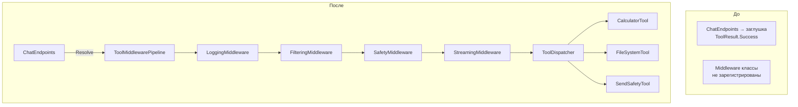

# План: Подключение Tool Middleware Pipeline

## Текущая ситуация

`IToolMiddleware` (4 реализации) и `ToolMiddlewarePipeline` полностью написаны, но **не зарегистрированы** в DI-контейнере. В `ChatEndpoints` при вызове инструментов используется заглушка `Task.FromResult(ToolResult.Success(...))`.

**Задача:** подключить middleware pipeline к рабочему процессу.

---

## Шаг 1. Зарегистрировать ToolDefinition в DI

В [`InfrastructureServiceRegistration.cs`](src/LLM_Demo.Infrastructure/DI/InfrastructureServiceRegistration.cs) после строки с `IToolRegistry` добавить регистрацию статических `ToolDefinition` из существующих инструментов.

**Что сделать:** добавить 3 вызова `services.AddSingleton<ToolDefinition>(...)` для:
- `CalculatorTool.Definition` — см. [`CalculatorTool.cs:11`](src/LLM_Demo.Infrastructure/Tools/CalculatorTool.cs:11)
- `FileSystemTool.Definition` — см. [`FileSystemTool.cs:22`](src/LLM_Demo.Infrastructure/Tools/FileSystemTool.cs:22)
- `SendSafetyTool.Definition` — см. [`SendSafetyTool.cs:19`](src/LLM_Demo.Infrastructure/Tools/SendSafetyTool.cs:19)

Это наполнит `ToolRegistry` актуальными инструментами.

---

## Шаг 2. Создать ToolDispatcher и зарегистрировать его в DI

**Проблема:** `ToolMiddlewarePipeline.CoreHandler` должен реально выполнять инструмент. Нужен диспетчер, который по имени инструмента вызывает нужный класс.

**Что сделать:** создать новый файл `src/LLM_Demo.Application/Middleware/ToolDispatcher.cs`:

```csharp
namespace LLM_Demo.Application.Middleware;

using LLM_Demo.Domain.Agents;
using LLM_Demo.Domain.Middleware;
using LLM_Demo.Domain.Tools;
using LLM_Demo.Infrastructure.Tools;
using Microsoft.Extensions.DependencyInjection;
using Microsoft.Extensions.Logging;

/// <summary>
/// Dispatches tool calls to concrete tool implementations.
/// </summary>
public sealed class ToolDispatcher
{
    private readonly IServiceProvider _serviceProvider;
    private readonly IToolRegistry _toolRegistry;
    private readonly ILogger<ToolDispatcher> _logger;

    public ToolDispatcher(
        IServiceProvider serviceProvider,
        IToolRegistry toolRegistry,
        ILogger<ToolDispatcher> logger)
    {
        _serviceProvider = serviceProvider;
        _toolRegistry = toolRegistry;
        _logger = logger;
    }

    public async Task<ToolResult> ExecuteAsync(ToolMiddlewareContext context)
    {
        var toolName = context.ToolCall.Name;
        var toolDef = _toolRegistry.GetTool(toolName);

        if (toolDef is null)
        {
            _logger.LogWarning("Tool '{ToolName}' not found in registry", toolName);
            return ToolResult.Failure($"Tool '{toolName}' is not available.");
        }

        _logger.LogDebug("Dispatching tool '{ToolName}' with arguments: {Arguments}",
            toolName, context.ToolCall.Arguments);

        // Диспетчеризация по имени инструмента
        return toolName.ToLowerInvariant() switch
        {
            "calculator" => ExecuteCalculator(context.ToolCall.Arguments),
            "file_system" => await ExecuteFileSystemAsync(context.ToolCall.Arguments),
            "send_safety" => await ExecuteSendSafetyAsync(context.ToolCall.Arguments),
            _ => ToolResult.Failure($"Tool '{toolName}' has no handler registered.")
        };
    }

    private ToolResult ExecuteCalculator(string arguments)
    {
        // arguments — это JSON, например {"expression": "2 + 2"}
        // Для простоты парсим expression
        try
        {
            using var doc = System.Text.Json.JsonDocument.Parse(arguments);
            var expression = doc.RootElement.GetProperty("expression").GetString() ?? "";
            var calculator = new CalculatorTool();
            return calculator.Execute(expression);
        }
        catch (Exception ex)
        {
            return ToolResult.Failure($"Calculator error: {ex.Message}");
        }
    }

    private async Task<ToolResult> ExecuteFileSystemAsync(string arguments)
    {
        try
        {
            using var doc = System.Text.Json.JsonDocument.Parse(arguments);
            var action = doc.RootElement.GetProperty("action").GetString() ?? "";
            var filename = doc.RootElement.GetProperty("filename").GetString() ?? "";
            var content = doc.RootElement.TryGetProperty("content", out var contentEl)
                ? contentEl.GetString()
                : null;

            var fsTool = ActivatorUtilities.CreateInstance<FileSystemTool>(_serviceProvider);
            return await fsTool.ExecuteAsync(action, filename, content);
        }
        catch (Exception ex)
        {
            return ToolResult.Failure($"FileSystem error: {ex.Message}");
        }
    }

    private async Task<ToolResult> ExecuteSendSafetyAsync(string arguments)
    {
        try
        {
            using var doc = System.Text.Json.JsonDocument.Parse(arguments);
            var content = doc.RootElement.GetProperty("content").GetString() ?? "";
            var destination = doc.RootElement.GetProperty("destination").GetString() ?? "";

            var safetyTool = ActivatorUtilities.CreateInstance<SendSafetyTool>(_serviceProvider);
            return await safetyTool.ExecuteAsync(content, destination);
        }
        catch (Exception ex)
        {
            return ToolResult.Failure($"SendSafety error: {ex.Message}");
        }
    }
}
```

**Файл:** [`src/LLM_Demo.Application/Middleware/ToolDispatcher.cs`](src/LLM_Demo.Application/Middleware/ToolDispatcher.cs) (новый)

Также зарегистрировать в [`ApplicationServiceRegistration.cs`](src/LLM_Demo.Application/DI/ApplicationServiceRegistration.cs):
```csharp
services.AddSingleton<ToolDispatcher>();
```

---

## Шаг 3. Зарегистрировать IToolMiddleware + StreamingHandler + ToolMiddlewarePipeline в DI

В [`ApplicationServiceRegistration.cs`](src/LLM_Demo.Application/DI/ApplicationServiceRegistration.cs) после существующих регистраций добавить:

```csharp
// StreamingHandler для SSE-трансляции
services.AddSingleton<StreamingHandler>();

// Middleware (порядок регистрации = порядок выполнения)
services.AddSingleton<IToolMiddleware, LoggingMiddleware>();
services.AddSingleton<IToolMiddleware, FilteringMiddleware>();
services.AddSingleton<IToolMiddleware, SafetyMiddleware>();
services.AddSingleton<IToolMiddleware, StreamingMiddleware>();

// Pipeline
services.AddSingleton<ToolMiddlewarePipeline>(sp =>
{
    var middlewares = sp.GetServices<IToolMiddleware>();
    var dispatcher = sp.GetRequiredService<ToolDispatcher>();
    var logger = sp.GetRequiredService<ILogger<ToolMiddlewarePipeline>>();

    return new ToolMiddlewarePipeline(middlewares, dispatcher.ExecuteAsync, logger);
});
```

**Важно:** порядок регистрации middleware определяет порядок выполнения:
1. `LoggingMiddleware` — логирует вызов
2. `FilteringMiddleware` — проверяет права агента
3. `SafetyMiddleware` — проверяет аргументы на опасные паттерны
4. `StreamingMiddleware` — транслирует через SSE

---

## Шаг 4. Модифицировать ChatEndpoints для использования pipeline

В [`ChatEndpoints.cs:112-115`](src/LLM_Demo.Api/Endpoints/ChatEndpoints.cs:112) заменить лямбду-заглушку на вызов pipeline:

```csharp
// Было:
var loop = new MAFAgentLoop(
    _connectorProvider,
    (toolCall, agent, ct) => Task.FromResult(ToolResult.Success($"Executed {toolCall.Name}")),
    _loopLogger);

// Стало:
var loop = new MAFAgentLoop(
    _connectorProvider,
    async (toolCall, agent, ct) =>
    {
        var pipeline = httpContext.RequestServices.GetRequiredService<ToolMiddlewarePipeline>();
        var context = new ToolMiddlewareContext
        {
            ToolCall = toolCall,
            Agent = agent,
            CancellationToken = ct
        };
        return await pipeline.ExecuteAsync(context);
    },
    _loopLogger);
```

---

## Шаг 5. Проверка

**Что должно измениться в поведении:**

| Сценарий | Ожидаемый результат |
|---|---|
| Агент вызывает `calculator` | Лог вызова → проверка прав → safety check → SSE → вычисление результата |
| Агент вызывает неразрешённый инструмент | `FilteringMiddleware` возвращает `ToolResult.Failure("not allowed")`, цепочка прерывается |
| Агент вызывает инструмент с `rm -rf` в аргументах | `SafetyMiddleware` блокирует вызов |
| Все вызовы логируются | `LoggingMiddleware` пишет имя, аргументы, длительность |
| Подписчики SSE получают уведомления | `StreamingMiddleware` транслирует начало и результат tool call |

---

## Схема изменений



---

## Итого: изменяемые файлы

| Файл | Действие |
|---|---|
| [`src/LLM_Demo.Infrastructure/DI/InfrastructureServiceRegistration.cs`](src/LLM_Demo.Infrastructure/DI/InfrastructureServiceRegistration.cs) | Добавить регистрацию 3× `ToolDefinition` |
| [`src/LLM_Demo.Application/Middleware/ToolDispatcher.cs`](src/LLM_Demo.Application/Middleware/ToolDispatcher.cs) | **Создать** — диспетчер вызовов |
| [`src/LLM_Demo.Application/DI/ApplicationServiceRegistration.cs`](src/LLM_Demo.Application/DI/ApplicationServiceRegistration.cs) | Добавить регистрацию `StreamingHandler`, 4× `IToolMiddleware`, `ToolDispatcher`, `ToolMiddlewarePipeline` |
| [`src/LLM_Demo.Api/Endpoints/ChatEndpoints.cs`](src/LLM_Demo.Api/Endpoints/ChatEndpoints.cs) | Заменить заглушку на вызов pipeline |
