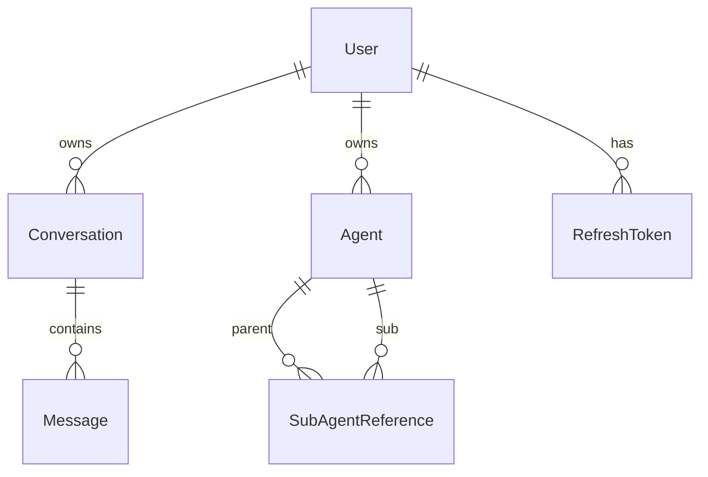

# Работа с миграциями EF Core в LLM_Demo

## Быстрый старт

### Предусловия

Убедитесь, что установлен `dotnet-ef`:

```bash
dotnet tool install --global dotnet-ef
```

Проверить:

```bash
dotnet ef --version
```

---

## Рабочий процесс

### 1. Изменили модель (добавили/изменили entity)

Допустим, вы добавили новое поле в `Agent` или создали новую сущность в Domain.

### 2. Создаём миграцию

Выполните из корня проекта (`d:/work/LLM_Demo`):

```bash
dotnet ef migrations add <НазваниеМиграции> --project src/LLM_Demo.Infrastructure --startup-project src/LLM_Demo.Api
```

**Пример:**

```bash
dotnet ef migrations Add AgentModelExtension --project src/LLM_Demo.Infrastructure --startup-project src/LLM_Demo.Api
```

Где:

- `--project` — проект с `AppDbContext` (Infrastructure)
- `--startup-project` — проект, который запускается (Api), там зарегистрирован `AppDbContext`

### 3. Проверяем сгенерированный файл

Миграция создаётся в папке:

```
src/LLM_Demo.Infrastructure/Persistence/Migrations/
```

Посмотрите файлы:

- `YYYYMMDDHHMMSS_<Name>.cs` — код миграции (Up/Down методы)
- `YYYYMMDDHHMMSS_<Name>.Designer.cs` — метаданные (не редактировать)

### 4. Применяем миграцию к БД

```bash
dotnet ef database update --project src/LLM_Demo.Infrastructure --startup-project src/LLM_Demo.Api
```

ИЛИ применится автоматически при следующем запуске API — `DbSeeder.SeedAsync()` вызывает `context.Database.MigrateAsync()`.

---

## Частые сценарии

### Откатить последнюю миграцию

```bash
dotnet ef migrations remove --project src/LLM_Demo.Infrastructure --startup-project src/LLM_Demo.Api
```

> **Важно:** Эта команда удаляет **только последнюю** миграцию. Если она уже применена к БД, сначала откатите БД:
> ```bash
> dotnet ef database update <ПредыдущаяМиграция> --project src/LLM_Demo.Infrastructure --startup-project src/LLM_Demo.Api
> ```
> Например: `dotnet ef database update InitialCreate`

### Откатить БД к определённой миграции

```bash
dotnet ef database update <ИмяМиграции> --project src/LLM_Demo.Infrastructure --startup-project src/LLM_Demo.Api
```

### Посмотреть список всех миграций

```bash
dotnet ef migrations list --project src/LLM_Demo.Infrastructure --startup-project src/LLM_Demo.Api
```

### Посмотреть сгенерированный SQL (без применения)

```bash
dotnet ef migrations script --project src/LLM_Demo.Infrastructure --startup-project src/LLM_Demo.Api
```

### Создать SQL-скрипт миграции

```bash
dotnet ef migrations script --output script.sql --project src/LLM_Demo.Infrastructure --startup-project src/LLM_Demo.Api
```

---

## Типовой сценарий: добавили новую сущность

Допустим, вы добавили entity `Category` в `src/LLM_Demo.Domain/Categories/Category.cs`:

```csharp
public sealed class Category
{
    public Guid Id { get; set; }
    public string Name { get; set; } = string.Empty;
}
```

**Шаги:**

1. Добавить `DbSet<Category> Categories` в [`AppDbContext`](src/LLM_Demo.Infrastructure/Persistence/AppDbContext.cs) и настроить fluent-конфигурацию в `OnModelCreating`
2. Создать репозиторий `CategoryRepository` при необходимости
3. Выполнить:
   ```bash
   dotnet ef migrations add AddCategoryEntity --project src/LLM_Demo.Infrastructure --startup-project src/LLM_Demo.Api
   dotnet ef database update --project src/LLM_Demo.Infrastructure --startup-project src/LLM_Demo.Api
   ```

---

## Схема БД (актуальная)



Все таблицы расположены в схеме `llm_demo` PostgreSQL.
