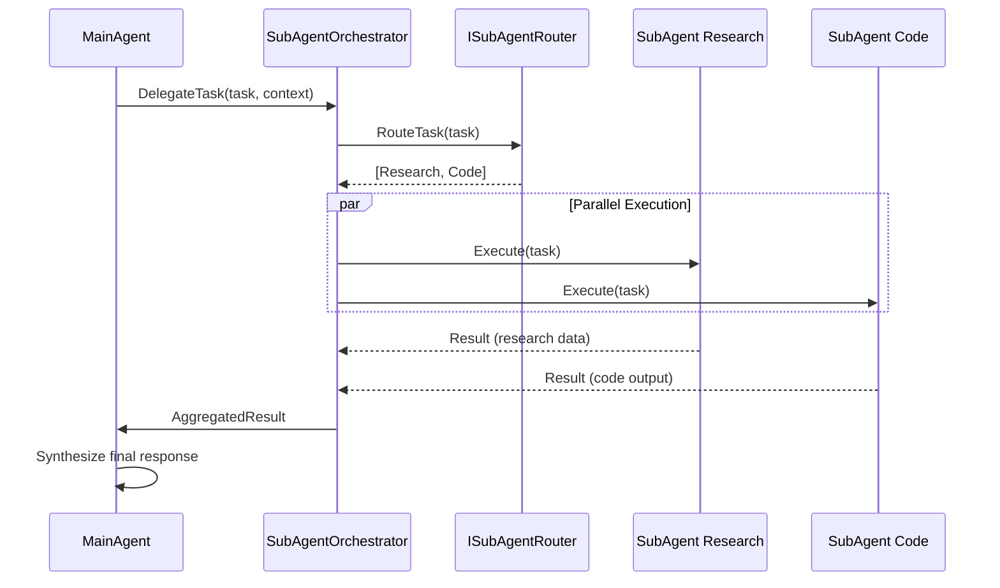
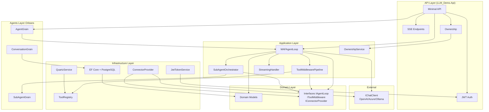

# 🏗️ LLM_Demo — План проекта

## 📋 Обзор

Проект **LLM_Demo** — это Multi-Agent Framework на C# 12 / .NET 8, построенный поверх `IChatClient` (Microsoft.Extensions.AI), с интеграцией **Orleans** для распределённых агентов и **Semantic Kernel** для AI-оркестрации.

---

## 🧱 1. Решение и структура проектов

```
LLM_Demo/
├── src/
│   ├── LLM_Demo.Domain/              # Domain models, interfaces
│   ├── LLM_Demo.Application/         # Use cases, agent loop, middleware
│   ├── LLM_Demo.Infrastructure/      # EF Core, connectors, tools, Quartz
│   ├── LLM_Demo.Agents/             # Orleans grains
│   └── LLM_Demo.Api/                # Minimal API, SSE, JWT
├── tests/
│   └── LLM_Demo.Tests/
├── docker-compose.yml               # PostgreSQL + Orleans clustering
├── .gitignore
└── plans/
    └── project-plan.md
```

**NuGet-пакеты (основные):**
- `Microsoft.Extensions.AI` / `Microsoft.Extensions.AI.OpenAI` — IChatClient
- `Microsoft.Orleans.Server`, `Microsoft.Orleans.Clustering.AdoNet`, `Microsoft.Orleans.Persistence.AdoNet`
- `Microsoft.SemanticKernel`
- `Quartz`, `Quartz.Extensions.Hosting`
- `Npgsql`, `Npgsql.EntityFrameworkCore.PostgreSQL`
- `Microsoft.EntityFrameworkCore`, `Microsoft.EntityFrameworkCore.Design`
- `Microsoft.AspNetCore.Authentication.JwtBearer`
- `Swashbuckle.AspNetCore` / `Microsoft.AspNetCore.OpenApi`

---

## 🏛️ 2. Архитектура (Clean Architecture)

### 2.1. Domain Layer — `LLM_Demo.Domain`

```
Domain/
├── Agents/
│   ├── Agent.cs                        # Агент (Id, Name, SystemPrompt, Tools)
│   ├── AgentStatus.cs                  # Enum: Idle, Running, WaitingForSubAgent, Error
│   └── SubAgentReference.cs            # Ссылка на субагента (Id, ParentId)
├── Messages/
│   ├── Message.cs                      # Сообщение (Id, Role, Content, Timestamp, ConversationId)
│   ├── MessageRole.cs                  # Enum: System, User, Assistant, Tool
│   └── StreamingChunk.cs              # Чанк для SSE
├── Conversations/
│   ├── Conversation.cs                 # Беседа (Id, Title, OwnerId, CreatedAt)
│   └── ConversationStatus.cs           # Enum: Active, Archived, Completed
├── Tools/
│   ├── ToolDefinition.cs               # Определение инструмента (Name, Description, Parameters)
│   ├── ToolResult.cs                   # Результат выполнения инструмента
│   └── ToolCall.cs                     # Вызов инструмента (Id, Name, Arguments)
├── Middleware/
│   ├── IToolMiddleware.cs              # Интерфейс middleware для инструментов
│   └── ToolMiddlewareContext.cs        # Контекст (ToolCall, Message, Agent, CancellationToken)
├── Connectors/
│   └── IConnectorProvider.cs           # Интерфейс провайдера коннекторов
├── Agents/
│   └── IAgentLoop.cs                   # Основной интерфейс agent loop
├── Common/
│   ├── IRepository.cs                  # Generic репозиторий
│   └── Result.cs                       # Result<T> — монада для обработки ошибок
└── Ownership/
    └── IOwnable.cs                     # Интерфейс для проверки владельца
```

### 2.2. Application Layer — `LLM_Demo.Application`

```
Application/
├── AgentLoop/
│   ├── MAFAgentLoop.cs                 # Основной loop поверх IChatClient
│   ├── IAgentLoopOptions.cs            # Options (MaxIterations, StopOnToolCall, etc.)
│   └── AgentLoopResult.cs             # Результат выполнения loop
├── Middleware/
│   ├── ToolMiddlewarePipeline.cs        # Chain-of-responsibility пайплайн
│   ├── FilteringMiddleware.cs          # Фильтрация (доступные инструменты, безопасность)
│   ├── StreamingMiddleware.cs          # Потоковая передача чанков через SSE
│   ├── LoggingMiddleware.cs            # Логирование вызовов инструментов
│   └── SafetyMiddleware.cs            # Safety-фильтрация (send-safety)
├── SubAgents/
│   ├── SubAgentOrchestrator.cs         # Координатор субагентов
│   ├── SubAgentStrategy.cs             # Стратегия: Sequential, Parallel, Hierarchical
│   └── ISubAgentRouter.cs             # Роутер — какой субагент вызывать
├── Streaming/
│   ├── StreamingHandler.cs             # Обработчик SSE-стримов
│   └── ISubscriber.cs                 # Интерфейс подписчика на стрим
├── Orchestration/
│   ├── AgentOrchestrator.cs            # Оркестратор агентов (SK + Orleans)
│   └── OrchestratorOptions.cs
├── Ownership/
│   └── OwnershipService.cs             # Сервис проверки владельца
└── DI/
    └── ApplicationServiceRegistration.cs  # Регистрация сервисов в DI
```

### 2.3. Infrastructure Layer — `LLM_Demo.Infrastructure`

```
Infrastructure/
├── Persistence/
│   ├── AppDbContext.cs                  # EF Core DbContext
│   ├── Configurations/
│   │   ├── AgentConfiguration.cs        # Fluent API конфигурация Agent
│   │   ├── MessageConfiguration.cs      # Fluent API конфигурация Message
│   │   └── ConversationConfiguration.cs # Fluent API конфигурация Conversation
│   ├── Migrations/                      # EF Core миграции
│   └── Repositories/
│       ├── AgentRepository.cs
│       ├── ConversationRepository.cs
│       └── UnitOfWork.cs
├── Connectors/
│   ├── ConnectorProvider.cs             # Реализация IConnectorProvider
│   ├── OpenAIConnector.cs               # Коннектор к OpenAI
│   ├── AzureOpenAIConnector.cs          # Коннектор к Azure OpenAI
│   └── OllamaConnector.cs               # Коннектор к локальной Ollama
├── Tools/
│   ├── SendSafetyTool.cs                # Tool: send-safety (SafetyMiddleware)
│   ├── QuartzSchedulerTool.cs           # Tool: шедулинг через Quartz
│   ├── FileSystemTool.cs                # Tool: работа с файлами
│   ├── WebSearchTool.cs                 # Tool: веб-поиск
│   ├── CalculatorTool.cs                # Tool: калькулятор
│   └── ToolRegistry.cs                  # Реестр доступных инструментов
├── Scheduling/
│   ├── QuartzService.cs                 # Quartz scheduler service
│   ├── AgentJob.cs                      # Job для запуска агента по расписанию
│   └── ToolJob.cs                       # Job для выполнения инструмента по расписанию
├── Auth/
│   ├── JwtTokenService.cs               # Генерация/валидация JWT
│   └── JwtOptions.cs                    # Настройки JWT (issuer, audience, key)
└── DI/
    └── InfrastructureServiceRegistration.cs
```

### 2.4. Agents Layer — `LLM_Demo.Agents` (Orleans)

```
Agents/
├── Grains/
│   ├── AgentGrain.cs                    # [IAgentGrain] — основной гран агента
│   ├── ConversationGrain.cs             # [IConversationGrain] — гран беседы
│   ├── SubAgentGrain.cs                 # [ISubAgentGrain] — гран субагента
│   └── SupervisorGrain.cs              # [ISupervisorGrain] — супервизор
├── Interfaces/
│   ├── IAgentGrain.cs
│   ├── IConversationGrain.cs
│   ├── ISubAgentGrain.cs
│   └── ISupervisorGrain.cs
├── Services/
│   └── GrainFactoryService.cs           # Фабрика для создания гран
└── Configuration/
    └── OrleansConfigurator.cs           # Настройка Orleans silo
```

### 2.5. API Layer — `LLM_Demo.Api`

```
Api/
├── Program.cs                           # Точка входа
├── appsettings.json                     # Конфигурация
├── appsettings.Development.json
├── Endpoints/
│   ├── AgentEndpoints.cs                # CRUD агентов
│   ├── ConversationEndpoints.cs         # CRUD бесед
│   ├── ChatEndpoints.cs                 # Чат с агентом (с/без стриминга)
│   ├── ToolEndpoints.cs                 # Доступные инструменты
│   ├── AuthEndpoints.cs                 # Login / Register / Refresh
│   ├── AdminEndpoints.cs                # Админка (Quartz jobs, мониторинг)
│   └── SseEndpoints.cs                  # SSE-эндпоинты для стриминга
├── Middleware/
│   ├── JwtMiddleware.cs                 # JWT аутентификация
│   ├── OwnershipMiddleware.cs           # Проверка владельца ресурса
│   └── ExceptionHandlingMiddleware.cs   # Глобальная обработка ошибок
├── Models/
│   ├── Requests/
│   │   ├── ChatRequest.cs
│   │   ├── CreateAgentRequest.cs
│   │   └── RegisterRequest.cs
│   └── Responses/
│       ├── ChatResponse.cs
│       ├── AuthResponse.cs
│       └── ErrorResponse.cs
├── Filters/
│   └── OwnershipFilter.cs               # IEndpointFilter для ownership
├── Hubs/
│   └── SseConnectionManager.cs          # Менеджер SSE-подключений
└── Extensions/
    ├── ServiceCollectionExtensions.cs   # DI регистрация
    └── WebApplicationExtensions.cs      # Middleware pipeline
```

---

## 🔄 3. Ключевые потоки (Flows)

### 3.1. Agent Loop (MAF поверх IChatClient)

```mermaid
sequenceDiagram
    participant User
    participant API as Minimal API
    participant Loop as MAFAgentLoop
    participant Pipeline as ToolMiddlewarePipeline
    participant Tools as Tool
    participant LLM as IChatClient

    User->>API: POST /chat (Message)
    API->>Loop: ExecuteAsync(conversation, agent)
    
    loop Iteration [MaxIterations]
        Loop->>LLM: GetResponseAsync(history, tools)
        LLM-->>Loop: ChatResponse
        
        alt Tool Call
            Loop->>Pipeline: Execute(ToolCall)
            Pipeline->>Pipeline: FilteringMiddleware
            Pipeline->>Pipeline: SafetyMiddleware
            Pipeline->>Pipeline: LoggingMiddleware
            Pipeline->>Tools: InvokeAsync
            Tools-->>Pipeline: ToolResult
            Pipeline-->>Loop: FilteredResult
            Loop->>LLM: Send ToolResult back
        else Final Response
            Loop-->>API: AgentLoopResult
            API-->>User: JSON / SSE Stream
        end
    end
```

### 3.2. SSE Streaming Flow

```mermaid
sequenceDiagram
    participant Client
    participant API as SSE Endpoint
    participant Loop as MAFAgentLoop
    participant Stream as StreamingMiddleware
    participant LLM as IChatClient

    Client->>API: GET /chat/stream?agentId=X&conversationId=Y
    API->>API: JWT + Ownership check
    API->>API: Set response Content-Type: text/event-stream
    
    Client->>API: POST message via SSE channel
    
    Loop->>LLM: GetStreamingResponseAsync
    LLM-->>Stream: IAsyncEnumerable<StreamingChunk>
    
    loop Each chunk
        Stream-->>API: StreamingChunk
        API-->>Client: event: chunk<br>data: {...}
    end
    
    API-->>Client: event: complete<br>data: {final: true}
    API-->>Client: event: done
```

### 3.3. Sub-Agent Orchestration



### 3.4. Quartz Scheduling Flow

```mermaid
sequenceDiagram
    participant User
    participant API
    participant Quartz as QuartzService
    participant Agent as AgentGrain
    participant Loop as MAFAgentLoop

    User->>API: POST /agents/{id}/schedule {cron, task}
    API->>Quartz: ScheduleJob(agentId, cronExpression)
    Quartz->>Quartz: Create JobDetail + Trigger
    
    Note over Quartz: Time passes...
    
    Quartz->>Quartz: Fire Trigger
    Quartz->>Agent: ExecuteScheduledTask(task)
    Agent->>Loop: ExecuteAsync
    Loop-->>Agent: Result
    Agent-->>Quartz: JobResult
    Quartz-->>API: Log result / notify user
```

---

## 🧩 4. Компоненты детально

### 4.1. MAFAgentLoop

```csharp
// Domain/Agents/IAgentLoop.cs
public interface IAgentLoop
{
    Task<AgentLoopResult> ExecuteAsync(
        Conversation conversation,
        Agent agent,
        CancellationToken ct = default);
    
    IAsyncEnumerable<StreamingChunk> ExecuteStreamingAsync(
        Conversation conversation,
        Agent agent,
        CancellationToken ct = default);
}
```

**Алгоритм работы:**
1. Формирует историю сообщений из Conversation
2. Добавляет SystemPrompt агента
3. Вызывает `IChatClient.GetResponseAsync()` с ToolDefinition
4. Если ответ содержит ToolCall — запускает ToolMiddlewarePipeline
5. Результат тула отправляется обратно в LLM
6. Повторяет до MaxIterations или получения финального ответа
7. Поддерживает стриминг через `IAsyncEnumerable<StreamingChunk>`

### 4.2. Tool Middleware Pipeline

```csharp
// Domain/Middleware/IToolMiddleware.cs
public interface IToolMiddleware
{
    Task<ToolResult> ExecuteAsync(
        ToolMiddlewareContext context,
        Func<ToolMiddlewareContext, Task<ToolResult>> next);
}
```

**Встроенные middleware (порядок):**
1. **LoggingMiddleware** — логирование входящих/исходящих вызовов
2. **FilteringMiddleware** — проверка, разрешён ли инструмент для данного агента
3. **SafetyMiddleware** — send-safety фильтрация аргументов
4. **StreamingMiddleware** — передача чанков подписчикам SSE

### 4.3. IConnectorProvider

```csharp
// Domain/Connectors/IConnectorProvider.cs
public interface IConnectorProvider
{
    IChatClient GetClient(string connectorName);
    IEnumerable<string> GetAvailableConnectors();
    Task<bool> TestConnectionAsync(string connectorName);
}
```

**Реализации:**
- `OpenAIConnector` — стандартный OpenAI (GPT-4, GPT-3.5)
- `AzureOpenAIConnector` — Azure OpenAI Service
- `OllamaConnector` — локальные модели через Ollama

### 4.4. Send-Safety Tool

```csharp
// Infrastructure/Tools/SendSafetyTool.cs
// Фильтрует исходящие сообщения по политикам безопасности:
// - PII detection
// - Content moderation
// - Rate limiting
// - Allowed destinations whitelist
```

### 4.5. Quartz Integration

```csharp
// Infrastructure/Scheduling/QuartzService.cs
// - ScheduleAgentJob: запуск агента по cron
// - ScheduleToolJob: выполнение инструмента по расписанию
// - ListScheduledJobs: просмотр запланированных задач
// - UnscheduleJob: отмена задачи
```

### 4.6. Ownership

```csharp
// Domain/Ownership/IOwnable.cs
public interface IOwnable
{
    string OwnerId { get; }
}

// Application/Ownership/OwnershipService.cs
// - Проверяет, что OwnerId совпадает с userId из JWT
// - Используется в OwnershipMiddleware и OwnershipFilter
```

### 4.7. API Endpoints

| Method | Path | Description | Auth |
|--------|------|-------------|------|
| POST | `/api/auth/register` | Регистрация | No |
| POST | `/api/auth/login` | Логин, получение JWT | No |
| POST | `/api/auth/refresh` | Refresh token | Yes |
| GET | `/api/agents` | Список агентов | Yes |
| POST | `/api/agents` | Создать агента | Yes |
| GET | `/api/agents/{id}` | Получить агента | Yes+Owner |
| PUT | `/api/agents/{id}` | Обновить агента | Yes+Owner |
| DELETE | `/api/agents/{id}` | Удалить агента | Yes+Owner |
| POST | `/api/agents/{id}/schedule` | Запланировать агента | Yes+Owner |
| DELETE | `/api/agents/{id}/schedule/{jobId}` | Отменить шедул | Yes+Owner |
| GET | `/api/conversations` | Список бесед | Yes |
| POST | `/api/conversations` | Создать беседу | Yes |
| GET | `/api/conversations/{id}` | Получить беседу | Yes+Owner |
| POST | `/api/chat/{agentId}` | Чат (без стриминга) | Yes |
| GET | `/api/chat/{agentId}/stream` | Чат (SSE стриминг) | Yes |
| GET | `/api/tools` | Доступные инструменты | Yes |
| GET | `/api/admin/jobs` | Список Quartz jobs | Admin |
| DELETE | `/api/admin/jobs/{jobId}` | Удалить job | Admin |

---

## 📅 5. Этапы реализации

### Этап 1: Базовый скелет и Domain
- [x] Создать solution и проекты
- [ ] Реализовать Domain models
- [ ] Реализовать базовые интерфейсы (IAgentLoop, IToolMiddleware, IConnectorProvider, IOwnable)
- [ ] Настроить docker-compose для PostgreSQL

### Этап 2: Infrastructure — Persistence & Auth
- [ ] Настроить EF Core + PostgreSQL (AppDbContext, миграции)
- [ ] Реализовать репозитории
- [ ] Реализовать JwtTokenService
- [ ] Реализовать ConnectorProvider и базовые коннекторы

### Этап 3: Application — Agent Loop
- [ ] Реализовать MAFAgentLoop
- [ ] Реализовать ToolMiddlewarePipeline
- [ ] Реализовать FilteringMiddleware + SafetyMiddleware
- [ ] Реализовать LoggingMiddleware
- [ ] Реализовать SubAgentOrchestrator

### Этап 4: API — Minimal API + SSE
- [ ] Реализовать Auth endpoints
- [ ] Реализовать CRUD endpoints (Agents, Conversations)
- [ ] Реализовать Chat endpoint
- [ ] Реализовать SSE streaming
- [ ] OwnershipMiddleware + OwnershipFilter

### Этап 5: Tools & Connectors
- [ ] Реализовать SendSafetyTool
- [ ] Реализовать базовые инструменты (FileSystem, Calculator)
- [ ] Реализовать QuartzSchedulerTool + QuartzService
- [ ] WebSearchTool

### Этап 6: Orleans Integration
- [ ] Реализовать AgentGrain
- [ ] Реализовать ConversationGrain
- [ ] Реализовать SubAgentGrain
- [ ] SupervisorGrain
- [ ] Настроить Orleans silo

### Этап 7: Тестирование
- [ ] Unit-тесты для MAFAgentLoop
- [ ] Unit-тесты для middleware pipeline
- [ ] Unit-тесты для инструментов
- [ ] Integration-тесты для API

---

## 🐳 6. docker-compose.yml

```yaml
services:
  postgres:
    image: postgres:16
    environment:
      POSTGRES_DB: llm_demo
      POSTGRES_USER: llm_demo_user
      POSTGRES_PASSWORD: llm_demo_pass
    ports:
      - "5432:5432"
    volumes:
      - postgres_data:/var/lib/postgresql/data

  orleans-db:
    image: postgres:16
    environment:
      POSTGRES_DB: orleans
      POSTGRES_USER: orleans_user
      POSTGRES_PASSWORD: orleans_pass
    ports:
      - "5433:5432"
    volumes:
      - orleans_data:/var/lib/postgresql/data

volumes:
  postgres_data:
  orleans_data:
```

---

## 📐 7. Диаграмма слоёв



---

## ⚙️ 8. Технические решения

### 8.1. Почему Orleans?
- **Stateful агенты**: каждый агент — persistent grain с собственным состоянием
- **Распределённость**: горизонтальное масштабирование без переписывания логики
- **Субагенты**: естественная модель через grain-иерархию
- **Streaming**: Orleans Streaming для событий агентов

### 8.2. Почему Semantic Kernel?
- **AI-оркестрация**: SK Kernel как надстройка над IChatClient
- **Plugin система**: SK plugins можно использовать как инструменты
- **Memory**: векторная память для агентов

### 8.3. Почему IChatClient (MEAI)?
- **Стандартизация**: единый интерфейс под OpenAI, Azure, Ollama
- **Лёгкость замены**: смена модели без изменения кода
- **Tool Calling**: встроенная поддержка function calling

### 8.4. SSE vs SignalR
- **SSE**: проще, однонаправленный стриминг сервер→клиент, нативный EventSource
- **SignalR**: двунаправленный, но избыточен для нашей задачи (стриминг логов агента)
- **Выбор**: SSE + POST для отправки сообщений в стрим
