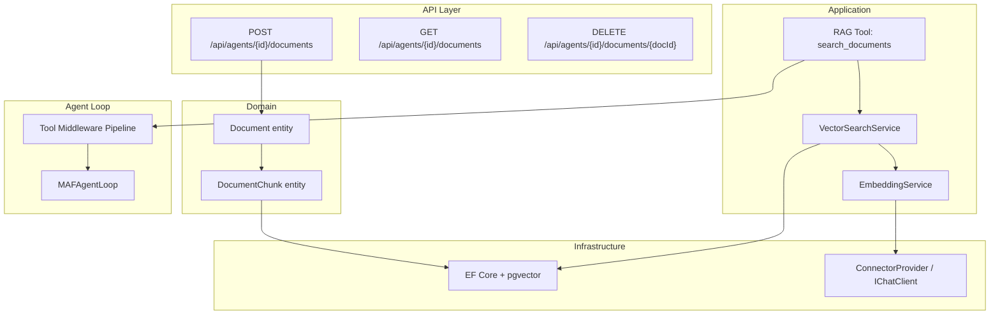

# План интеграции RAG в LLM_Demo

## Обзор

Добавление RAG (Retrieval-Augmented Generation) в проект позволит агенту искать релевантные документы из своей базы знаний и использовать их для формирования более точных ответов. RAG будет реализован как **Tool** — агент сам решает, когда вызвать поиск по документам.

## Ключевые решения

| Параметр | Решение |
|---|---|
| Векторная БД | `pgvector` — расширение PostgreSQL (уже используется) |
| Embeddings | Через существующий OpenAI-совместимый LLM-коннектор |
| Тип интеграции | **Tool** — `search_documents` (агент сам решает, когда вызывать) |
| Область видимости | **Per-agent** — каждый агент имеет свою базу знаний |
| Загрузка данных | Через API (REST endpoints) |
| Хранение | Документы + чанки с векторами в PostgreSQL/pgvector |

---

## Архитектура



---

## Пошаговый план реализации

### Шаг 1: Добавление pgvector в Docker Compose

**Файл:** [`docker/docker-compose.yml`](docker/docker-compose.yml)

- Добавить расширение `pgvector` в образ PostgreSQL (переключиться на `pgvector/pgvector:0.8.0` или выполнить `CREATE EXTENSION vector` через init-скрипт)
- PostgreSQL 16 с pgvector доступен как образ `pgvector/pgvector:0.8.0-pg16`

### Шаг 2: Создание доменных моделей

**Файлы:** 
- [`src/LLM_Demo.Domain/Documents/Document.cs`](src/LLM_Demo.Domain/Documents/Document.cs)
- [`src/LLM_Demo.Domain/Documents/DocumentChunk.cs`](src/LLM_Demo.Domain/Documents/DocumentChunk.cs)

Модели:
- `Document` — Id, AgentId, Name, ContentType, CreatedAt
- `DocumentChunk` — Id, DocumentId, Content (текст фрагмента), Embedding (вектор float[]), ChunkIndex

### Шаг 3: Настройка EF Core + pgvector

**Файлы:**
- [`src/LLM_Demo.Domain/LLM_Demo.Domain.csproj`](src/LLM_Demo.Domain/LLM_Demo.Domain.csproj) — добавить `pgvector` NuGet
- [`src/LLM_Demo.Infrastructure/Persistence/AppDbContext.cs`](src/LLM_Demo.Infrastructure/Persistence/AppDbContext.cs) — добавить `DbSet<Document>` и `DbSet<DocumentChunk>`, настроить entity configuration с использованием `pgvector`
- Создать и применить миграцию

**NuGet пакет для Domain:**
```
dotnet add src/LLM_Demo.Domain/LLM_Demo.Domain.csproj package Pgvector.EntityFrameworkCore
```

### Шаг 4: Создание EmbeddingService

**Файл:** [`src/LLM_Demo.Application/RAG/EmbeddingService.cs`](src/LLM_Demo.Application/RAG/EmbeddingService.cs)

- Использует `IConnectorProvider` для получения `IChatClient`
- Отправляет запрос к LLM API с параметром `dimensions` (если модель поддерживает) для получения эмбеддингов
- Формирует embedding-запрос через OpenAI-compatible `/embeddings` endpoint
- Возвращает `float[]` вектор

**Важно:** Embedding-запросы отличаются от chat completion. Нужно использовать отдельный endpoint `/embeddings`. Потребуется либо создать отдельный embedding-клиент, либо использовать встроенный `OpenAIEmbeddingGenerator` из `Microsoft.Extensions.AI.OpenAI`.

### Шаг 5: Создание VectorSearchService

**Файл:** [`src/LLM_Demo.Application/RAG/VectorSearchService.cs`](src/LLM_Demo.Application/RAG/VectorSearchService.cs)

- Принимает текст запроса + AgentId
- Вызывает `EmbeddingService` для получения вектора запроса
- Выполняет поиск по `DocumentChunk` с сортировкой по косинусной дистанции (`<->`) через pgvector
- Возвращает топ-K наиболее релевантных чанков (например, 5)

### Шаг 6: Создание DocumentService (загрузка и чанкование)

**Файл:** [`src/LLM_Demo.Application/RAG/DocumentService.cs`](src/LLM_Demo.Application/RAG/DocumentService.cs)

- Принимает текст документа + AgentId
- Разбивает документ на чанки (например, по 500 токенов с перекрытием 50)
- Для каждого чанка вызывает `EmbeddingService` для получения вектора
- Сохраняет `Document` + `DocumentChunk` через репозиторий/контекст

### Шаг 7: Создание RAG Tool (search_documents)

**Файлы:**
- [`src/LLM_Demo.Infrastructure/Tools/RagTool.cs`](src/LLM_Demo.Infrastructure/Tools/RagTool.cs)
- [`src/LLM_Demo.Domain/Tools/ToolDefinition.cs`](src/LLM_Demo.Domain/Tools/ToolDefinition.cs) — новая константа

Реализация Tool'а:
```csharp
public static ToolDefinition Definition => new()
{
    Name = "search_documents",
    Description = "Searches the agent's knowledge base for relevant documents. " +
                  "Use this tool when you need specific information from uploaded documents " +
                  "to answer the user's question. Provide a search query describing what you're looking for."
};
```

Tool принимает параметр `query` — поисковый запрос, находит релевантные чанки через `VectorSearchService` и возвращает их содержимое как результат.

### Шаг 8: API Endpoints для управления документами

**Файл:** [`src/LLM_Demo.Api/Endpoints/DocumentEndpoints.cs`](src/LLM_Demo.Api/Endpoints/DocumentEndpoints.cs)

| Method | Path | Description |
|--------|------|-------------|
| `POST` | `/api/agents/{agentId}/documents` | Загрузить документ (text/plain body) |
| `GET` | `/api/agents/{agentId}/documents` | Список документов агента |
| `GET` | `/api/agents/{agentId}/documents/{docId}` | Получить документ с чанками |
| `DELETE` | `/api/agents/{agentId}/documents/{docId}` | Удалить документ и его чанки |

Все endpoints проверяют ownership агента (как в существующих endpoints).

### Шаг 9: Регистрация в DI

**Файлы:**
- [`src/LLM_Demo.Infrastructure/DI/InfrastructureServiceRegistration.cs`](src/LLM_Demo.Infrastructure/DI/InfrastructureServiceRegistration.cs) — добавить `RagTool.Definition` в ToolDefinition'ы
- [`src/LLM_Demo.Application/DI/ApplicationServiceRegistration.cs`](src/LLM_Demo.Application/DI/ApplicationServiceRegistration.cs) — добавить `EmbeddingService`, `VectorSearchService`, `DocumentService`
- [`src/LLM_Demo.Api/Program.cs`](src/LLM_Demo.Api/Program.cs) — добавить `DocumentEndpoints` в DI и map endpoints

### Шаг 10: Настройка Embedding-клиента (конфигурация)

**Файл:** [`src/LLM_Demo.Api/appsettings.json`](src/LLM_Demo.Api/appsettings.json)

Добавить секцию конфигурации для embedding-модели (может совпадать с LLM-провайдером или быть отдельной):

```json
"Embedding": {
  "Endpoint": "https://routerai.ru/api/v1",
  "ModelId": "text-embedding-ada-002",
  "ApiKey": ""
}
```

---

## Детальная архитектура классов

```
Domain/
  Documents/
    Document.cs          // + owned entities config
    DocumentChunk.cs     // + owned entities config

Application/
  RAG/
    IEmbeddingService.cs      // interface
    EmbeddingService.cs       // implementation using IConnectorProvider
    IVectorSearchService.cs   // interface  
    VectorSearchService.cs    // implementation using EF + pgvector
    IDocumentService.cs       // interface
    DocumentService.cs        // chunking + embedding + storage

Infrastructure/
  Tools/
    RagTool.cs                // search_documents tool

Api/
  Endpoints/
    DocumentEndpoints.cs      // CRUD for agent documents
```

---

## Зависимости NuGet

| Проект | Пакет | Версия |
|--------|-------|--------|
| `LLM_Demo.Domain` | `Pgvector.EntityFrameworkCore` | 0.4.0+ |
| `LLM_Demo.Infrastructure` | `Microsoft.Extensions.AI.OpenAI` | уже есть |

`Microsoft.Extensions.AI.OpenAI` уже включён в Infrastructure и предоставляет `OpenAIEmbeddingGenerator` для работы с эмбеддингами.

---

## Пример потока работы

1. Пользователь загружает документ через `POST /api/agents/{id}/documents`
2. `DocumentService` разбивает документ на чанки, для каждого получает embedding через `EmbeddingService`, сохраняет в БД
3. Пользователь задаёт вопрос агенту в чате
4. `MAFAgentLoop` запускается, LLM решает, что нужна информация из документов
5. Агент вызывает Tool `search_documents(query: "как настроить ...")`
6. `RagTool` → `VectorSearchService` → `EmbeddingService` (получает вектор запроса) → pgvector search → возвращает найденные чанки
7. LLM получает чанки как результат Tool'а и формирует ответ на их основе
8. Пользователь видит ответ, подкреплённый документами

---

## Схема БД (новые таблицы)

```sql
-- Таблица документов (в схеме llm_demo)
CREATE TABLE llm_demo.Documents (
    Id UUID PRIMARY KEY,
    AgentId UUID NOT NULL REFERENCES llm_demo.Agents(Id) ON DELETE CASCADE,
    Name VARCHAR(512) NOT NULL,
    ContentType VARCHAR(128) NOT NULL DEFAULT 'text/plain',
    CreatedAt TIMESTAMPTZ NOT NULL DEFAULT NOW()
);

CREATE INDEX IX_Documents_AgentId ON llm_demo.Documents(AgentId);

-- Таблица чанков с векторами
CREATE TABLE llm_demo.DocumentChunks (
    Id UUID PRIMARY KEY,
    DocumentId UUID NOT NULL REFERENCES llm_demo.Documents(Id) ON DELETE CASCADE,
    Content TEXT NOT NULL,
    Embedding vector(1536),  -- размерность зависит от модели эмбеддингов
    ChunkIndex INT NOT NULL
);

CREATE INDEX IX_DocumentChunks_DocumentId ON llm_demo.DocumentChunks(DocumentId);
CREATE INDEX IX_DocumentChunks_Embedding ON llm_demo.DocumentChunks 
    USING hnsw (Embedding vector_cosine_ops);  -- HNSW индекс для быстрого поиска
```
