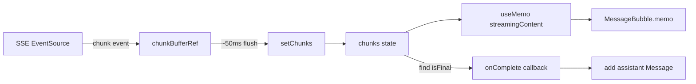

# План исправления зависания React при SSE-стриминге

## Корневая причина

Каждый SSE-чанк (токен) вызывает `setChunks` в `useChatSSE.ts`, что триггерит полный ререндер:
`ChatPage → ChatMessages → MessageBubble`. При 500+ токенах React не успевает отрисовывать и зависает.

## Изменения по файлам

### 1. `src/LLM_Demo.Frontend/src/hooks/useChatSSE.ts` — добавить throttling

**Проблема:** `setChunks((prev) => [...prev, chunk])` вызывается на каждое SSE-событие `chunk`.

**Решение:** Добавить накопление чанков в `useRef` с периодическим сбросом в state через `requestAnimationFrame` или `setInterval` (~50-100ms).

**Изменения:**
- Добавить `chunkBufferRef = useRef<StreamingChunk[]>([])`
- В обработчике `chunk` пушить в `chunkBufferRef.current` и вызывать `scheduleFlush()`
- `scheduleFlush` использует `requestAnimationFrame` или `setTimeout` для сброса буфера в `setChunks` раз в ~50ms
- На `complete`/`cancelled`/`error` принудительно сбрасывать буфер

### 2. `src/LLM_Demo.Frontend/src/hooks/useChatSSE.ts` — добавить `streamingContent` в возвращаемое значение

**Проблема:** `ChatMessages.tsx` самостоятельно вычисляет `streamingContent` из массива чанков.

**Решение:** Сделать предварительно собранный контент частью возвращаемого значения хука, чтобы компонентам не нужно было джойнить массив.

### 3. `src/LLM_Demo.Frontend/src/components/ChatMessages.tsx` — мемоизация streamingContent

**Проблема:** `streamingContent` пересчитывается на каждый рендер (`filter + map + join`).

**Решение:** Обернуть в `useMemo` с зависимостью `[streamingChunks]`.

### 4. `src/LLM_Demo.Frontend/src/pages/ChatPage.tsx` — оптимизация эффекта finalChunk

**Проблема:** Эффект с `[chunks]` срабатывает на каждый новый чанк, но нужен только при `isFinal`.

**Решение:**
- Перенести логику сборки финального сообщения в `useChatSSE` через колбэк `onComplete`
- Либо использовать `useRef` для lastChunk и сравнивать с предыдущим

### 5. `src/LLM_Demo.Frontend/src/components/MessageBubble.tsx` — React.memo

**Проблема:** Все `MessageBubble` (включая исторические) ререндерятся при каждом новом чанке.

**Решение:** Обернуть в `React.memo`.

## Диаграмма потока данных (оптимизированного)

## Порядок реализации

1. Оптимизировать `useChatSSE.ts` — добавить buffer + throttle + `streamingContent`
2. Обновить `ChatMessages.tsx` — использовать `streamingContent` из пропсов или `useMemo`
3. Обновить `ChatPage.tsx` — упростить эффект finalChunk
4. Обернуть `MessageBubble` в `React.memo`
