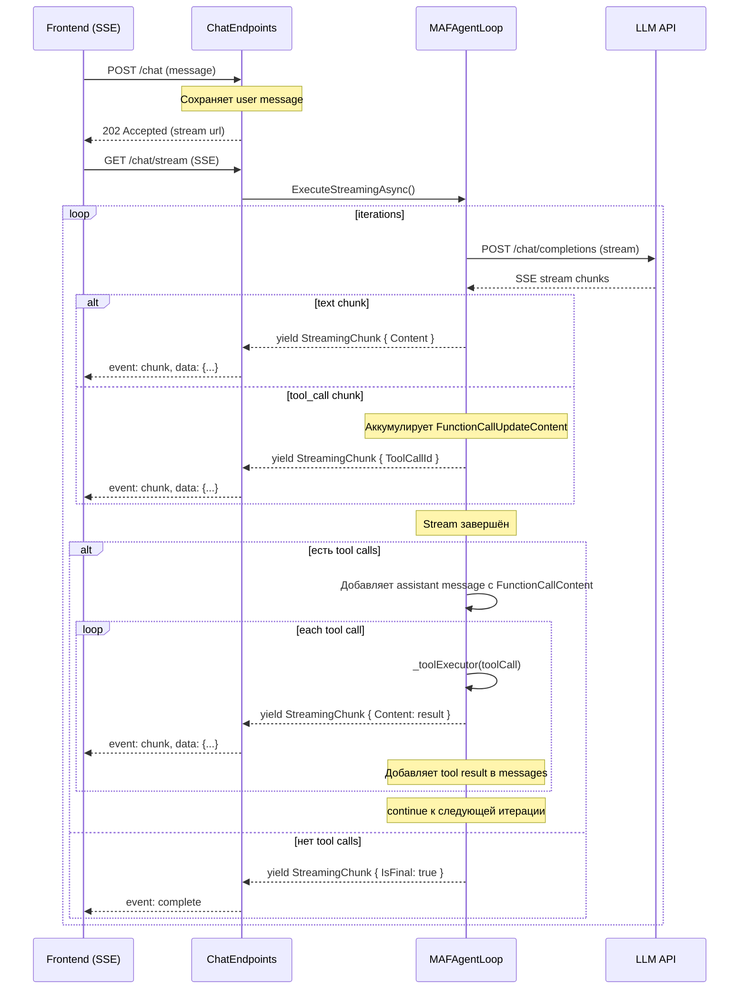

# План: Добавление обработки Tools в ExecuteStreamingAsync

## 1. Текущая архитектура

### ExecuteAsync (работает)
имеет цикл итераций:
1. Вызов `chatClient.CompleteAsync()` → получает `ChatMessage`
2. [`ExtractToolCalls()`](src/LLM_Demo.Application/AgentLoop/MAFAgentLoop.cs:192) извлекает `FunctionCallContent` из `message.Contents`
3. Если есть tool calls → выполняет через `_toolExecutor`, добавляет результат в `messages`, повторяет цикл
4. Если нет → возвращает финальный ответ

### ExecuteStreamingAsync (не работает с tools)
просто стримит текст, без цикла итераций и без обработки tool calls.

### StreamingChunk
```csharp
public sealed class StreamingChunk
{
    public string Content { get; set; } = string.Empty;
    public bool IsFinal { get; set; }
    public string? ToolCallId { get; set; }
    public string? Error { get; set; }
}
```
Уже содержит поля `ToolCallId` и `Error` — готов к стримингу tool-событий.

### OpenAIConnector
Текущий SSE-парсер читает только `delta.content`. Не парсит `delta.tool_calls`.

### ChatEndpoints
Текущий SSE-обработчик добавляет все чанки в `responseBuilder`, включая tool call чанки (что неверно).

---

## 2. Поток данных



---

## 3. Изменения по файлам

### 3.1 [`MAFAgentLoop.ExecuteStreamingAsync`](src/LLM_Demo.Application/AgentLoop/MAFAgentLoop.cs:149)

**Что меняем:** Добавляем цикл итераций с аккумуляцией tool calls из стрима и их выполнением.

**Логика:**
1. `while (iterations < _options.MaxIterations)` — внешний цикл
2. `chatClient.CompleteStreamingAsync()` запускает стрим
3. В стриме аккумулируем:
   - текст: `fullText.Append(update.Text)` + yield
   - tool call updates из `update.Contents`: ищем `FunctionCallUpdateContent`
4. После завершения стрима:
   - Если есть tool calls → создаём `ChatMessage` с `FunctionCallContent`, выполняем каждый tool, добавляем результаты в messages, **continue**
   - Если нет → yield `IsFinal`, **break**

**Псевдокод:**
```csharp
public async IAsyncEnumerable<StreamingChunk> ExecuteStreamingAsync(
    Conversation conversation, Agent agent,
    IReadOnlyList<Message>? historyMessages = null,
    string? newUserMessage = null,
    CancellationToken ct = default)
{
    var messages = BuildMessages(agent, historyMessages, newUserMessage);
    var chatClient = GetChatClient(agent);
    var chatOptions = BuildChatOptions(agent);
    var iterations = 0;

    while (iterations < _options.MaxIterations)
    {
        ct.ThrowIfCancellationRequested();
        iterations++;

        var fullText = new StringBuilder();
        var toolCallAccumulators = new Dictionary<string, (string Name, StringBuilder Args)>();

        // Streaming
        await foreach (var update in chatClient.CompleteStreamingAsync(messages, chatOptions, ct))
        {
            ct.ThrowIfCancellationRequested();

            if (update.Text is { Length: > 0 })
            {
                fullText.Append(update.Text);
                yield return new StreamingChunk { Content = update.Text };
            }

            if (update.Contents is { Count: > 0 })
            {
                foreach (var content in update.Contents)
                {
                    if (content is FunctionCallUpdateContent fc)
                    {
                        var callId = fc.CallId ?? Guid.NewGuid().ToString();
                        if (!string.IsNullOrEmpty(fc.Name))
                        {
                            toolCallAccumulators[callId] = (fc.Name, new StringBuilder());
                            yield return new StreamingChunk
                            {
                                Content = $"[call: {fc.Name}]",
                                ToolCallId = callId
                            };
                        }
                        else if (toolCallAccumulators.TryGetValue(callId, out var acc))
                        {
                            acc.Args.Append(fc.Arguments);
                        }
                    }
                }
            }
        }

        // Если есть tool calls — выполняем
        if (toolCallAccumulators.Count > 0)
        {
            var contents = new List<AIContent>();
            foreach (var kv in toolCallAccumulators)
            {
                contents.Add(new FunctionCallContent(kv.Key, kv.Value.Name, kv.Value.Args.ToString()));
            }

            var assistantMsg = new ChatMessage(ChatRole.Assistant, fullText.ToString()) { Contents = contents };
            messages.Add(assistantMsg);

            foreach (var kv in toolCallAccumulators)
            {
                var (callId, (name, argsBuilder)) = kv;
                var toolCall = new ToolCall
                {
                    Id = callId,
                    Name = name,
                    Arguments = argsBuilder.ToString()
                };

                var toolResult = await _toolExecutor(toolCall, agent, ct);

                yield return new StreamingChunk
                {
                    Content = $"  {toolResult.Result}",
                    ToolCallId = callId
                };

                messages.Add(new ChatMessage(ChatRole.Tool, toolResult.Result));

                if (!toolResult.IsSuccess && _options.StopOnToolError)
                {
                    yield return new StreamingChunk { Error = toolResult.Error ?? "Tool failed" };
                    yield return new StreamingChunk { IsFinal = true };
                    yield break;
                }
            }

            continue; // следующая итерация
        }

        // Финальный ответ без tool calls
        yield return new StreamingChunk { IsFinal = true };
        yield break;
    }

    // Max iterations reached
    _logger.LogWarning(...);
    yield return new StreamingChunk { IsFinal = true };
}
```

### 3.2 [`OpenAIConnector.CompleteStreamingAsync`](src/LLM_Demo.Infrastructure/Connectors/OpenAIConnector.cs:100)

**Что меняем:** Добавляем парсинг `delta.tool_calls` из SSE-потока.

**Новые DTO:**
```csharp
private sealed class StreamingChunkResponse
{
    public StreamingChoice[]? choices { get; set; }
}

private sealed class StreamingChoice
{
    public Delta? delta { get; set; }
}

private sealed class Delta
{
    public string? content { get; set; }
    public ToolCallDelta[]? tool_calls { get; set; }
}

private sealed class ToolCallDelta
{
    public string? id { get; set; }
    public string? type { get; set; }
    public FunctionDelta? function { get; set; }
}

private sealed class FunctionDelta
{
    public string? name { get; set; }
    public string? arguments { get; set; }
}
```

**Изменение в цикле стриминга (строки 159-166):**
```csharp
var chunk = JsonSerializer.Deserialize<StreamingChunkResponse>(data);
if (chunk?.choices?.FirstOrDefault()?.delta is { } delta)
{
    var update = new StreamingChatCompletionUpdate();

    if (delta.content is { } text)
    {
        update.Text = text;
    }

    if (delta.tool_calls is { Length: > 0 })
    {
        var contents = new List<AIContent>();
        foreach (var tc in delta.tool_calls)
        {
            if (tc.type == "function")
            {
                contents.Add(new FunctionCallUpdateContent
                {
                    CallId = tc.id,
                    Name = tc.function?.name,
                    Arguments = tc.function?.arguments
                });
            }
        }
        if (contents.Count > 0)
        {
            update.Contents = contents;
        }
    }

    if (update.Text != null || (update.Contents?.Count > 0))
    {
        yield return update;
    }
}
```

### 3.3 [`ChatEndpoints.ChatStream`](src/LLM_Demo.Api/Endpoints/ChatEndpoints.cs:122)

**Что меняем:** Не добавляем tool call чанки в `responseBuilder`. Добавляем обработку `chunk.Error`.

```csharp
await foreach (var chunk in loop.ExecuteStreamingAsync(...))
{
    var json = JsonSerializer.Serialize(chunk, ...);
    await WriteSseAsync(httpContext, "chunk", json);

    // Tool call чанки — не добавляем в текст ответа
    if (chunk.ToolCallId != null)
    {
        _logger.LogDebug("Tool call {ToolCallId} result received", chunk.ToolCallId);
        continue;
    }

    // Ошибка — логируем
    if (chunk.Error != null)
    {
        _logger.LogWarning("Tool error: {Error}", chunk.Error);
        continue;
    }

    // Финальный чанк — сохраняем сообщение
    if (chunk.IsFinal)
    {
        var assistantMessage = new Message
        {
            Id = Guid.NewGuid(),
            ConversationId = conversation.Id,
            Role = MessageRole.Assistant,
            Content = responseBuilder.ToString()
        };
        await _conversationRepository.AddMessageAsync(assistantMessage, ct);
        await WriteSseAsync(httpContext, "complete", "{}");
        continue;
    }

    // Обычный текстовый чанк
    responseBuilder.Append(chunk.Content);
}
```

---

## 4. Порядок реализации

| № | Файл | Описание | Зависимости |
|---|------|----------|-------------|
| 1 | [`OpenAIConnector.cs`](src/LLM_Demo.Infrastructure/Connectors/OpenAIConnector.cs) | Добавить парсинг `delta.tool_calls` | Нет |
| 2 | [`MAFAgentLoop.cs`](src/LLM_Demo.Application/AgentLoop/MAFAgentLoop.cs) | Добавить цикл итераций + аккумуляцию tool calls | №1 |
| 3 | [`ChatEndpoints.cs`](src/LLM_Demo.Api/Endpoints/ChatEndpoints.cs) | Не добавлять tool call чанки в текст ответа | №2 |

---

## 5. Риски и замечания

1. **`CallId` может приходить не в первом чанке** — в спецификации OpenAI/совместимых API `tool_calls[].id` приходит только в первом чанке для данного tool call. Если CallId пришёл `null`, используем `Guid.NewGuid().ToString()` как фолбэк.
2. **Аргументы могут приходить частями** — каждое `delta.tool_calls[].function.arguments` — это фрагмент JSON, которые нужно конкатенировать.
3. **Некоторые API не поддерживают tool calls** — `EchoChatClient` не генерирует tool calls, поэтому цикл закончится на первой итерации. Это корректное поведение.
4. **Совместимость с EchoChatClient** — не меняем его, он не выдаёт `FunctionCallUpdateContent`.
